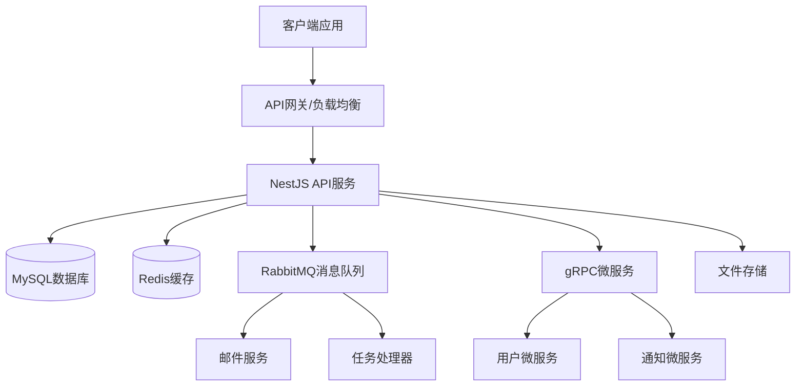
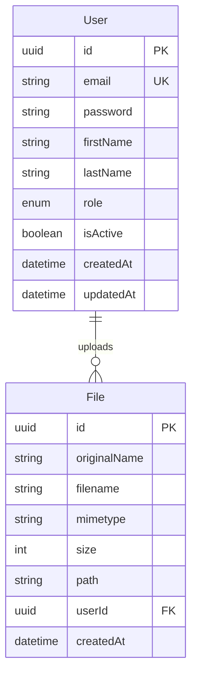

# NestJS学习API项目设计文档

## 概述

本项目是一个全面的NestJS学习平台，旨在通过实际的API开发涵盖现代后端开发的核心技术栈。项目采用模块化架构，集成MySQL、Redis、RabbitMQ、gRPC等技术，提供完整的学习和实践环境。

## 架构

### 整体架构



### 技术栈

- **运行时**: Node.js 18+
- **框架**: NestJS 10.x
- **语言**: TypeScript 5.x
- **数据库**: MySQL 8.0
- **缓存**: Redis 7.x
- **消息队列**: RabbitMQ 3.12
- **RPC**: gRPC with Protocol Buffers
- **容器化**: Docker & Docker Compose

## 组件和接口

### 核心模块结构

```
src/
├── app.module.ts                 # 根模块
├── main.ts                      # 应用入口
├── config/                      # 配置模块
│   ├── database.config.ts
│   ├── redis.config.ts
│   └── rabbitmq.config.ts
├── common/                      # 通用组件
│   ├── decorators/
│   ├── filters/
│   ├── guards/
│   ├── interceptors/
│   └── pipes/
├── modules/                     # 业务模块
│   ├── auth/                   # 认证模块
│   ├── users/                  # 用户模块
│   ├── files/                  # 文件模块
│   ├── cache/                  # 缓存模块
│   ├── queue/                  # 队列模块
│   └── grpc/                   # gRPC模块
├── entities/                    # 数据实体
├── dto/                        # 数据传输对象
├── migrations/                 # 数据库迁移
├── seeds/                      # 种子数据
└── proto/                      # Protocol Buffer定义
```

### 模块接口设计

#### 1. 认证模块 (AuthModule)
```typescript
interface AuthService {
  login(credentials: LoginDto): Promise<AuthResponse>
  register(userData: RegisterDto): Promise<User>
  validateToken(token: string): Promise<User>
  logout(token: string): Promise<void>
  refreshToken(refreshToken: string): Promise<AuthResponse>
}

interface AuthResponse {
  accessToken: string
  refreshToken: string
  user: UserDto
  expiresIn: number
}
```

#### 2. 用户模块 (UsersModule)
```typescript
interface UsersService {
  create(userData: CreateUserDto): Promise<User>
  findAll(query: QueryUserDto): Promise<PaginatedResult<User>>
  findById(id: string): Promise<User>
  update(id: string, userData: UpdateUserDto): Promise<User>
  delete(id: string): Promise<void>
}
```

#### 3. 缓存模块 (CacheModule)
```typescript
interface CacheService {
  get<T>(key: string): Promise<T | null>
  set(key: string, value: any, ttl?: number): Promise<void>
  del(key: string): Promise<void>
  exists(key: string): Promise<boolean>
  flush(): Promise<void>
}
```

#### 4. 队列模块 (QueueModule)
```typescript
interface QueueService {
  addJob(queue: string, data: any, options?: JobOptions): Promise<Job>
  process(queue: string, processor: JobProcessor): void
  getJob(jobId: string): Promise<Job>
  removeJob(jobId: string): Promise<void>
}
```

#### 5. gRPC模块 (GrpcModule)
```typescript
interface GrpcUserService {
  GetUser(request: GetUserRequest): Promise<UserResponse>
  CreateUser(request: CreateUserRequest): Promise<UserResponse>
  UpdateUser(request: UpdateUserRequest): Promise<UserResponse>
  DeleteUser(request: DeleteUserRequest): Promise<Empty>
}
```

## 数据模型

### 用户实体 (User Entity)
```typescript
@Entity('users')
export class User {
  @PrimaryGeneratedColumn('uuid')
  id: string

  @Column({ unique: true })
  email: string

  @Column()
  password: string

  @Column()
  firstName: string

  @Column()
  lastName: string

  @Column({ type: 'enum', enum: UserRole, default: UserRole.USER })
  role: UserRole

  @Column({ default: true })
  isActive: boolean

  @CreateDateColumn()
  createdAt: Date

  @UpdateDateColumn()
  updatedAt: Date

  @OneToMany(() => File, file => file.user)
  files: File[]
}
```

### 文件实体 (File Entity)
```typescript
@Entity('files')
export class File {
  @PrimaryGeneratedColumn('uuid')
  id: string

  @Column()
  originalName: string

  @Column()
  filename: string

  @Column()
  mimetype: string

  @Column()
  size: number

  @Column()
  path: string

  @ManyToOne(() => User, user => user.files)
  user: User

  @CreateDateColumn()
  createdAt: Date
}
```

### 数据库关系图


## 正确性属性

*属性是一个特征或行为，应该在系统的所有有效执行中保持为真——本质上是关于系统应该做什么的正式声明。属性作为人类可读规范和机器可验证正确性保证之间的桥梁。*

### 属性反思

在分析所有可测试的验收标准后，我识别出以下需要合并或消除冗余的属性：

- 属性2.1和2.2可以合并为一个全面的CRUD操作属性
- 属性4.1和4.2可以合并为缓存机制的综合属性
- 属性5.1和5.2可以合并为消息队列的往返属性
- 属性7.2和7.5可以合并为文件生命周期管理属性

### 核心属性

**属性 1: 配置加载完整性**
*对于任何* 必需的环境变量集合，应用启动时应该成功加载所有配置参数，缺少任何必需参数时应该失败
**验证: 需求 1.3**

**属性 2: 用户CRUD操作一致性**
*对于任何* 有效的用户数据，创建用户后应该能够查询到相同的用户信息，更新后应该反映变更，删除后应该无法查询到
**验证: 需求 2.1, 2.2, 2.3, 2.4**

**属性 3: 输入验证拒绝无效数据**
*对于任何* 无效的用户输入数据，系统应该拒绝请求并返回详细的验证错误信息
**验证: 需求 2.5**

**属性 4: JWT令牌生命周期管理**
*对于任何* 有效的用户凭据，登录应该生成有效的JWT令牌，该令牌应该允许访问受保护资源，注销后应该被加入黑名单
**验证: 需求 3.1, 3.2, 3.4**

**属性 5: 基于角色的访问控制**
*对于任何* 用户角色和资源组合，系统应该根据角色权限正确允许或拒绝访问
**验证: 需求 3.5**

**属性 6: 缓存一致性机制**
*对于任何* 可缓存的数据，首次查询应该从数据库获取并缓存，后续查询应该从缓存获取，数据更新时应该清除相关缓存
**验证: 需求 4.1, 4.2, 4.3**

**属性 7: 会话存储功能**
*对于任何* 用户会话，系统应该将会话信息存储在Redis中并能够正确检索
**验证: 需求 4.5**

**属性 8: 消息队列往返处理**
*对于任何* 异步任务，发送到消息队列的任务应该被正确接收和处理
**验证: 需求 5.1, 5.2**

**属性 9: 消息处理错误恢复**
*对于任何* 处理失败的消息，系统应该将其重新排队或发送到死信队列
**验证: 需求 5.3**

**属性 10: gRPC通信功能**
*对于任何* 有效的gRPC请求，服务应该处理请求并返回适当的响应数据
**验证: 需求 6.2**

**属性 11: Protocol Buffers序列化往返**
*对于任何* 有效的数据对象，使用Protocol Buffers序列化后反序列化应该产生等价的对象
**验证: 需求 6.3**

**属性 12: gRPC错误处理**
*对于任何* gRPC服务中发生的错误，应该返回适当的gRPC状态码和错误信息
**验证: 需求 6.4**

**属性 13: 文件上传验证**
*对于任何* 文件上传请求，系统应该验证文件类型和大小限制，拒绝不符合要求的文件
**验证: 需求 7.1**

**属性 14: 文件生命周期管理**
*对于任何* 上传的文件，应该正确存储到指定目录并在数据库中记录元数据，删除时应该从存储和数据库中完全移除
**验证: 需求 7.2, 7.5**

**属性 15: 文件下载权限验证**
*对于任何* 文件下载请求，系统应该验证用户权限，只允许授权用户下载文件
**验证: 需求 7.4**

**属性 16: API文档完整性**
*对于任何* API端点，生成的Swagger文档应该包含完整的请求参数、响应格式和示例
**验证: 需求 8.2**

**属性 17: HTTP请求日志记录**
*对于任何* HTTP请求，系统应该记录完整的请求和响应日志信息
**验证: 需求 9.1**

**属性 18: 错误日志详细记录**
*对于任何* 系统错误，应该记录详细的错误堆栈和上下文信息
**验证: 需求 9.2**

**属性 19: 性能监控日志**
*对于任何* 关键操作，系统应该记录执行时间用于性能监控
**验证: 需求 9.3**

**属性 20: 日志查询过滤**
*对于任何* 日志查询请求，系统应该支持按级别、时间和模块进行过滤
**验证: 需求 9.4**

## 错误处理

### 全局异常处理策略

```typescript
@Catch()
export class GlobalExceptionFilter implements ExceptionFilter {
  catch(exception: unknown, host: ArgumentsHost) {
    const ctx = host.switchToHttp()
    const response = ctx.getResponse()
    const request = ctx.getRequest()

    let status = HttpStatus.INTERNAL_SERVER_ERROR
    let message = 'Internal server error'

    if (exception instanceof HttpException) {
      status = exception.getStatus()
      message = exception.message
    } else if (exception instanceof ValidationError) {
      status = HttpStatus.BAD_REQUEST
      message = 'Validation failed'
    }

    const errorResponse = {
      statusCode: status,
      timestamp: new Date().toISOString(),
      path: request.url,
      method: request.method,
      message,
      ...(process.env.NODE_ENV === 'development' && { stack: exception.stack })
    }

    response.status(status).json(errorResponse)
  }
}
```

### 错误类型定义

1. **业务逻辑错误**: 用户操作违反业务规则
2. **验证错误**: 输入数据格式或内容不符合要求
3. **认证错误**: 用户身份验证失败
4. **授权错误**: 用户权限不足
5. **资源错误**: 请求的资源不存在
6. **外部服务错误**: 依赖的外部服务不可用
7. **系统错误**: 内部系统故障

### 错误恢复机制

- **数据库连接**: 自动重连机制，连接池管理
- **Redis连接**: 降级策略，跳过缓存直接查询数据库
- **RabbitMQ连接**: 消息持久化，重试机制
- **gRPC服务**: 熔断器模式，服务降级
- **文件操作**: 事务性操作，失败回滚

## 测试策略

### 双重测试方法

本项目采用单元测试和基于属性的测试相结合的方法：

- **单元测试**: 验证特定示例、边界情况和错误条件
- **基于属性的测试**: 验证应该在所有输入中保持的通用属性
- 两者互补提供全面覆盖：单元测试捕获具体错误，属性测试验证一般正确性

### 单元测试要求

单元测试通常覆盖：
- 演示正确行为的特定示例
- 组件之间的集成点
- 单元测试很有用，但避免写太多。属性测试的工作是处理大量输入的覆盖。

### 基于属性的测试要求

- 使用 **fast-check** 作为TypeScript/Node.js的属性测试库
- 每个属性测试配置为运行最少100次迭代，因为属性测试过程是随机的
- 每个属性测试必须用注释明确引用设计文档中的正确性属性
- 使用此确切格式标记每个属性测试：'**Feature: nestjs-learning-api, Property {number}: {property_text}**'
- 每个正确性属性必须由单个属性测试实现

### 测试框架配置

```typescript
// jest.config.js
module.exports = {
  moduleFileExtensions: ['js', 'json', 'ts'],
  rootDir: 'src',
  testRegex: '.*\\.spec\\.ts$',
  transform: {
    '^.+\\.(t|j)s$': 'ts-jest',
  },
  collectCoverageFrom: [
    '**/*.(t|j)s',
  ],
  coverageDirectory: '../coverage',
  testEnvironment: 'node',
  setupFilesAfterEnv: ['<rootDir>/test/setup.ts'],
}
```

### 测试数据库配置

```typescript
// test/setup.ts
import { Test } from '@nestjs/testing'
import { TypeOrmModule } from '@nestjs/typeorm'

export const createTestingModule = async () => {
  return Test.createTestingModule({
    imports: [
      TypeOrmModule.forRoot({
        type: 'sqlite',
        database: ':memory:',
        entities: [__dirname + '/../**/*.entity{.ts,.js}'],
        synchronize: true,
      }),
    ],
  })
}
```

### 性能测试

- **负载测试**: 使用Artillery.js进行API负载测试
- **压力测试**: 测试系统在极限条件下的表现
- **并发测试**: 验证多用户同时操作的正确性
- **内存泄漏测试**: 长时间运行检测内存使用情况

### 集成测试

- **数据库集成**: 测试与MySQL的完整交互
- **缓存集成**: 验证Redis缓存机制
- **消息队列集成**: 测试RabbitMQ消息处理
- **gRPC集成**: 验证微服务间通信
- **端到端测试**: 完整的用户场景测试