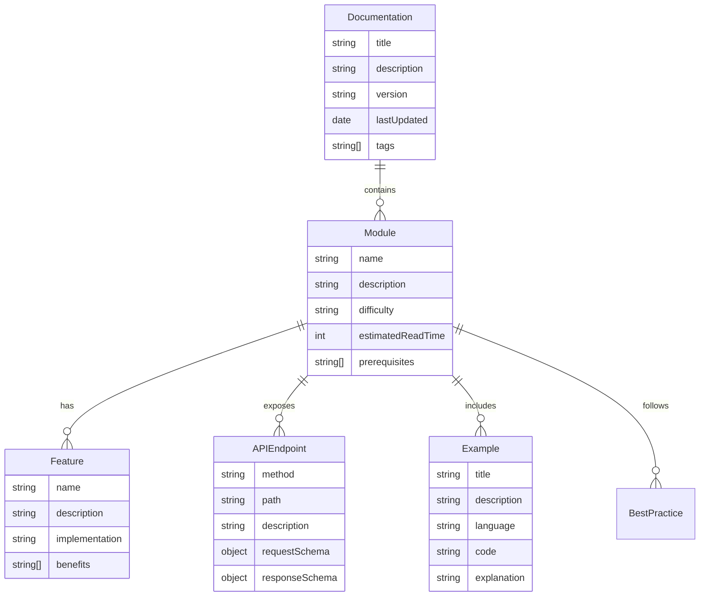

# NestJS功能模块文档设计

## 概述

本设计文档详细说明了如何为现有的NestJS学习API项目创建全面的中文功能模块说明文档。该文档系统将帮助学习者深入理解每个模块的功能、实现原理和最佳实践，提供完整的学习资源。

## 架构

### 文档结构设计

```mermaid
graph TB
    Root[docs/] --> Modules[modules/]
    Root --> API[api-reference/]
    Root --> Examples[examples/]
    Root --> Guides[guides/]
    
    Modules --> Auth[auth.md]
    Modules --> Users[users.md]
    Modules --> Cache[cache.md]
    Modules --> Queue[queue.md]
    Modules --> GRPC[grpc.md]
    Modules --> Files[files.md]
    Modules --> Logging[logging.md]
    Modules --> Database[database.md]
    Modules --> ErrorHandling[error-handling.md]
    Modules --> Health[health.md]
    
    API --> AuthAPI[auth-api.md]
    API --> UsersAPI[users-api.md]
    API --> CacheAPI[cache-api.md]
    
    Examples --> AuthExamples[auth-examples.md]
    Examples --> CacheExamples[cache-examples.md]
    Examples --> GRPCExamples[grpc-examples.md]
    
    Guides --> Setup[setup-guide.md]
    Guides --> Testing[testing-guide.md]
    Guides --> Deployment[deployment-guide.md]
```



### 技术栈

- **文档格式**: Markdown
- **代码高亮**: 支持TypeScript、JSON、Shell等
- **图表**: Mermaid图表支持
- **API文档**: OpenAPI/Swagger集成
- **示例代码**: 完整可运行的代码示例

## 组件和接口

### 文档模板结构

每个功能模块文档将遵循统一的结构模板：

```markdown
# 模块名称

## 概述
- 模块功能简介
- 核心特性列表
- 技术栈说明

## 功能特性
- 详细功能列表
- 实现原理说明
- 架构图表

## 配置说明
- 环境变量配置
- 模块配置选项
- 依赖服务配置

## API接口
- 端点列表
- 请求/响应格式
- 错误码说明

## 使用示例
- 基础使用方法
- 高级功能示例
- 集成示例

## 最佳实践
- 推荐使用方法
- 性能优化建议
- 安全注意事项

## 测试指南
- 单元测试示例
- 集成测试方法
- 性能测试建议

## 故障排除
- 常见问题解答
- 错误处理方法
- 调试技巧

## 相关资源
- 官方文档链接
- 学习资源推荐
- 社区资源
```

### 文档生成器接口

```typescript
interface DocumentationGenerator {
  generateModuleDoc(moduleName: string, moduleInfo: ModuleInfo): Promise<string>
  generateAPIReference(endpoints: APIEndpoint[]): Promise<string>
  generateExamples(examples: CodeExample[]): Promise<string>
  validateDocumentation(docPath: string): Promise<ValidationResult>
}

interface ModuleInfo {
  name: string
  description: string
  features: Feature[]
  configuration: Configuration
  apiEndpoints: APIEndpoint[]
  examples: CodeExample[]
  bestPractices: BestPractice[]
  troubleshooting: TroubleshootingItem[]
}

interface APIEndpoint {
  method: string
  path: string
  description: string
  requestSchema: object
  responseSchema: object
  examples: RequestResponseExample[]
  errorCodes: ErrorCode[]
}

interface CodeExample {
  title: string
  description: string
  language: string
  code: string
  explanation: string
}
```

## 数据模型

### 文档元数据模型

```typescript
interface DocumentMetadata {
  title: string
  description: string
  version: string
  lastUpdated: Date
  author: string
  tags: string[]
  difficulty: 'beginner' | 'intermediate' | 'advanced'
  estimatedReadTime: number
  prerequisites: string[]
  relatedModules: string[]
}

interface ModuleDocumentation {
  metadata: DocumentMetadata
  overview: ModuleOverview
  features: ModuleFeature[]
  configuration: ConfigurationSection
  apiReference: APIReference
  examples: ExampleSection[]
  bestPractices: BestPracticeSection
  testing: TestingSection
  troubleshooting: TroubleshootingSection
  resources: ResourceSection
}
```

### 内容结构模型



## 正确性属性

*属性是一个特征或行为，应该在系统的所有有效执行中保持为真——本质上是关于系统应该做什么的正式声明。属性作为人类可读规范和机器可验证正确性保证之间的桥梁。*

### 属性反思

在分析所有可测试的验收标准后，我识别出以下需要合并或消除冗余的属性：

- 多个模块的配置文档验证可以合并为一个通用的配置文档完整性属性
- 各模块的API接口文档验证可以合并为API文档完整性属性
- 不同模块的代码示例验证可以合并为代码示例完整性属性
- 各模块的错误处理文档可以合并为错误处理文档完整性属性

### 核心属性

**属性 1: 认证模块文档完整性**
*对于任何* 认证模块文档，应该包含JWT认证流程说明、API接口文档、权限控制解释、请求响应示例和安全机制说明
**验证: 需求 1.1, 1.2, 1.3, 1.4, 1.5**

**属性 2: 用户管理文档完整性**
*对于任何* 用户管理模块文档，应该包含CRUD操作说明、数据验证解释、数据库操作说明、分页查询说明和错误处理展示
**验证: 需求 2.1, 2.2, 2.3, 2.4, 2.5**

**属性 3: 缓存模块文档完整性**
*对于任何* 缓存模块文档，应该包含Redis配置说明、缓存策略解释、装饰器使用示例、会话管理说明和缓存失效策略解释
**验证: 需求 3.1, 3.2, 3.3, 3.4, 3.5**

**属性 4: 消息队列文档完整性**
*对于任何* 消息队列模块文档，应该包含RabbitMQ配置说明、消息生产解释、消息消费说明、错误处理解释和邮件服务示例
**验证: 需求 4.1, 4.2, 4.3, 4.4, 4.5**

**属性 5: gRPC模块文档完整性**
*对于任何* gRPC模块文档，应该包含Protocol Buffers说明、服务器创建解释、客户端使用示例、流式通信说明和错误处理解释
**验证: 需求 5.1, 5.2, 5.3, 5.4, 5.5**

**属性 6: 文件处理文档完整性**
*对于任何* 文件处理模块文档，应该包含文件上传配置说明、文件存储解释、图片处理实现方法、文件下载说明和文件管理解释
**验证: 需求 6.1, 6.2, 6.3, 6.4, 6.5**

**属性 7: 日志监控文档完整性**
*对于任何* 日志监控模块文档，应该包含Winston配置说明、请求日志解释、错误日志说明、性能监控示例和日志查询解释
**验证: 需求 7.1, 7.2, 7.3, 7.4, 7.5**

**属性 8: 数据库文档完整性**
*对于任何* 数据库模块文档，应该包含数据库配置说明、实体定义解释、迁移管理方法、种子数据说明和查询优化技巧
**验证: 需求 8.1, 8.2, 8.3, 8.4, 8.5**

**属性 9: 错误处理文档完整性**
*对于任何* 错误处理模块文档，应该包含异常过滤器实现说明、自定义异常解释、熔断机制示例、重试机制说明和降级处理实现方法
**验证: 需求 9.1, 9.2, 9.3, 9.4, 9.5**

**属性 10: 健康检查文档完整性**
*对于任何* 健康检查模块文档，应该包含健康检查端点实现、依赖检查解释、监控指标收集方法、告警机制说明和运维集成方法
**验证: 需求 10.1, 10.2, 10.3, 10.4, 10.5**

## 错误处理

### 文档生成错误处理

```typescript
class DocumentationError extends Error {
  constructor(
    public readonly type: 'TEMPLATE_ERROR' | 'VALIDATION_ERROR' | 'GENERATION_ERROR',
    message: string,
    public readonly context?: any
  ) {
    super(message)
    this.name = 'DocumentationError'
  }
}

class DocumentationValidator {
  validateModuleDoc(doc: ModuleDocumentation): ValidationResult {
    const errors: ValidationError[] = []
    
    // 验证必需章节
    if (!doc.overview) errors.push(new ValidationError('缺少概述章节'))
    if (!doc.features || doc.features.length === 0) {
      errors.push(new ValidationError('缺少功能特性章节'))
    }
    if (!doc.configuration) errors.push(new ValidationError('缺少配置说明章节'))
    if (!doc.apiReference) errors.push(new ValidationError('缺少API接口章节'))
    if (!doc.examples || doc.examples.length === 0) {
      errors.push(new ValidationError('缺少使用示例章节'))
    }
    
    // 验证代码示例
    doc.examples?.forEach((example, index) => {
      if (!example.code || example.code.trim().length === 0) {
        errors.push(new ValidationError(`示例 ${index + 1} 缺少代码内容`))
      }
      if (!example.explanation) {
        errors.push(new ValidationError(`示例 ${index + 1} 缺少解释说明`))
      }
    })
    
    return {
      isValid: errors.length === 0,
      errors
    }
  }
}
```

### 文档生成失败恢复

- **模板错误**: 使用备用模板或基础模板
- **内容缺失**: 提供占位符内容并标记待完善
- **格式错误**: 自动修复常见格式问题
- **依赖缺失**: 跳过依赖内容并记录警告

## 测试策略

### 双重测试方法

本项目采用单元测试和基于属性的测试相结合的方法：

- **单元测试**: 验证特定的文档生成功能、模板渲染和内容验证
- **基于属性的测试**: 验证文档完整性属性在所有模块中保持一致
- 两者互补提供全面覆盖：单元测试验证具体功能，属性测试验证文档质量

### 单元测试要求

单元测试覆盖：
- 文档模板渲染功能
- 内容提取和格式化
- API文档生成
- 代码示例验证
- 文档结构验证

### 基于属性的测试要求

- 使用 **fast-check** 作为TypeScript的属性测试库
- 每个属性测试配置为运行最少100次迭代
- 每个属性测试必须用注释引用设计文档中的正确性属性
- 标记格式：'**Feature: nestjs-module-documentation, Property {number}: {property_text}**'
- 每个正确性属性必须由单个属性测试实现

### 测试框架配置

```typescript
// jest.config.js for documentation tests
module.exports = {
  displayName: 'Documentation Tests',
  testMatch: ['**/docs/**/*.test.ts', '**/documentation/**/*.spec.ts'],
  collectCoverageFrom: [
    'src/documentation/**/*.ts',
    '!src/documentation/**/*.d.ts',
  ],
  coverageThreshold: {
    global: {
      branches: 80,
      functions: 80,
      lines: 80,
      statements: 80,
    },
  },
}
```

### 文档质量测试

```typescript
describe('Documentation Quality Tests', () => {
  test('should validate all module documentation completeness', async () => {
    const modules = ['auth', 'users', 'cache', 'queue', 'grpc', 'files', 'logging', 'database', 'error-handling', 'health']
    
    for (const module of modules) {
      const doc = await loadModuleDocumentation(module)
      const validation = validator.validateModuleDoc(doc)
      
      expect(validation.isValid).toBe(true)
      expect(validation.errors).toHaveLength(0)
    }
  })
  
  test('should ensure all code examples are executable', async () => {
    const allExamples = await extractAllCodeExamples()
    
    for (const example of allExamples) {
      if (example.language === 'typescript') {
        const result = await validateTypeScriptCode(example.code)
        expect(result.hasErrors).toBe(false)
      }
    }
  })
})
```

### 性能测试

- **文档生成速度**: 测试大量模块文档的生成时间
- **内存使用**: 监控文档生成过程的内存消耗
- **并发生成**: 测试同时生成多个模块文档的性能

### 可访问性测试

- **文档结构**: 验证标题层级和导航结构
- **代码可读性**: 检查代码示例的格式和注释
- **链接有效性**: 验证所有内部和外部链接的有效性

<function_calls>
<invoke name="prework">
<parameter name="featureName">nestjs-module-documentation