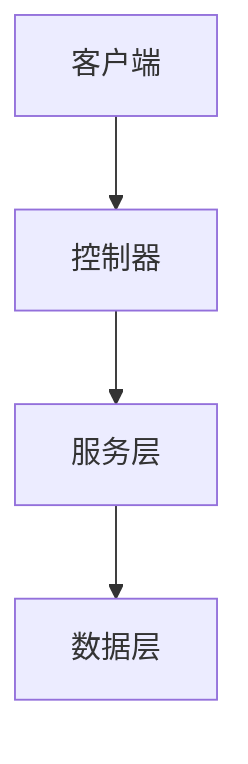

# 文档系统说明

## 概述

本文档系统为 NestJS 学习 API 项目提供了完整的文档生成、验证和管理解决方案。

## 目录结构

```
docs/
├── README.md                    # 主文档索引
├── DOCUMENTATION_SYSTEM.md     # 文档系统说明
├── modules/                     # 功能模块文档
├── api-reference/              # API 参考文档
├── examples/                   # 使用示例
├── guides/                     # 指南文档
├── templates/                  # 文档模板
│   ├── module-template.md      # 模块文档模板
│   └── api-template.md         # API 文档模板
└── config/                     # 配置文件
    └── docs-config.json        # 文档配置
```

## 脚本工具

### 文档生成器 (`scripts/generate-docs.js`)

用于根据模板和配置生成模块文档。

**功能特性:**
- 基于模板生成模块文档
- 生成 API 参考文档
- 支持变量替换和内容定制
- 文档完整性验证

**使用方法:**
```bash
# 生成所有文档
npm run docs:generate

# 验证特定文档
node scripts/generate-docs.js validate docs/modules/auth.md
```

### 文档验证器 (`scripts/validate-docs.js`)

用于验证文档的完整性和质量。

**功能特性:**
- 验证必需章节完整性
- 检查代码示例和链接有效性
- 生成验证报告和警告
- 文档覆盖率统计

**使用方法:**
```bash
# 验证所有文档
npm run docs:validate

# 检查文档覆盖率
npm run docs:coverage
```

## 文档模板系统

### 模块文档模板 (`docs/templates/module-template.md`)

标准化的模块文档结构，包含以下章节：
- 概述
- 功能特性
- 配置说明
- API接口
- 使用示例
- 最佳实践
- 测试指南
- 故障排除
- 相关资源

### API 文档模板 (`docs/templates/api-template.md`)

标准化的 API 文档结构，包含：
- 概述和基础信息
- 端点列表和参数说明
- 数据模型定义
- 使用示例
- 错误处理

## 配置系统

### 文档配置 (`docs/config/docs-config.json`)

包含项目信息、模块配置、模板路径和验证规则：

```json
{
  "project": {
    "name": "NestJS 学习 API",
    "description": "项目描述",
    "version": "1.0.0"
  },
  "modules": {
    "auth": {
      "name": "认证模块",
      "description": "JWT认证、角色权限控制系统",
      "difficulty": "intermediate"
    }
  }
}
```

## 文档编写规范

### 1. 章节结构

每个模块文档必须包含以下章节：
- `## 概述` - 模块功能简介
- `## 功能特性` - 详细功能列表
- `## 配置说明` - 环境变量和配置
- `## API接口` - 接口文档
- `## 使用示例` - 代码示例
- `## 最佳实践` - 推荐做法
- `## 测试指南` - 测试方法
- `## 故障排除` - 常见问题
- `## 相关资源` - 参考链接

### 2. 代码示例规范

```typescript
// 示例代码应该：
// 1. 完整可运行
// 2. 包含必要注释
// 3. 遵循项目代码规范
// 4. 提供清晰的解释说明

@Controller('auth')
export class AuthController {
  constructor(private authService: AuthService) {}

  @Post('login')
  async login(@Body() loginDto: LoginDto) {
    return this.authService.login(loginDto);
  }
}
```

### 3. 图表规范

使用 Mermaid 语法创建架构图：



## 质量保证

### 文档验证规则

1. **必需章节检查** - 确保所有必需章节存在
2. **代码示例验证** - 检查代码语法正确性
3. **链接有效性** - 验证内部链接可访问
4. **模板变量** - 检查未替换的模板变量
5. **图表语法** - 验证 Mermaid 图表语法

### 文档覆盖率

系统会自动检查以下模块的文档覆盖率：
- auth (认证模块)
- users (用户管理模块)
- cache (缓存模块)
- queue (消息队列模块)
- grpc (gRPC模块)
- files (文件处理模块)
- logging (日志监控模块)
- database (数据库模块)
- error-handling (错误处理模块)
- health (健康检查模块)

## 开发工作流

### 1. 创建新模块文档

```bash
# 1. 复制模板
cp docs/templates/module-template.md docs/modules/new-module.md

# 2. 编辑内容
# 替换模板变量，添加具体内容

# 3. 验证文档
npm run docs:validate

# 4. 检查覆盖率
npm run docs:coverage
```

### 2. 更新现有文档

```bash
# 1. 编辑文档内容
# 2. 运行验证
npm run docs:validate
# 3. 修复发现的问题
```

### 3. 生成完整文档集

```bash
# 生成所有模块文档
npm run docs:generate

# 验证生成结果
npm run docs:validate
```

## 扩展和定制

### 添加新的验证规则

在 `scripts/validate-docs.js` 中添加新的验证逻辑：

```javascript
// 添加自定义验证规则
validateCustomRule(content) {
  const errors = [];
  // 实现验证逻辑
  return errors;
}
```

### 创建新的文档模板

1. 在 `docs/templates/` 目录创建新模板
2. 在 `docs/config/docs-config.json` 中配置模板路径
3. 在生成器中添加对应的生成方法

### 集成外部工具

可以集成以下工具增强文档系统：
- **Swagger/OpenAPI** - 自动生成 API 文档
- **TypeDoc** - 从代码注释生成文档
- **Docusaurus** - 构建文档网站
- **GitBook** - 在线文档平台

## 故障排除

### 常见问题

1. **文档验证失败**
   - 检查必需章节是否完整
   - 验证代码示例语法
   - 确认链接有效性

2. **模板变量未替换**
   - 检查配置文件中的变量定义
   - 确认生成器中的替换逻辑

3. **脚本执行失败**
   - 确认 Node.js 版本兼容性
   - 检查依赖包是否安装完整

### 调试技巧

```bash
# 启用详细日志
DEBUG=docs:* npm run docs:validate

# 单独验证特定文档
node scripts/validate-docs.js validate docs/modules/auth.md

# 检查配置文件语法
node -e "console.log(JSON.parse(require('fs').readFileSync('docs/config/docs-config.json')))"
```