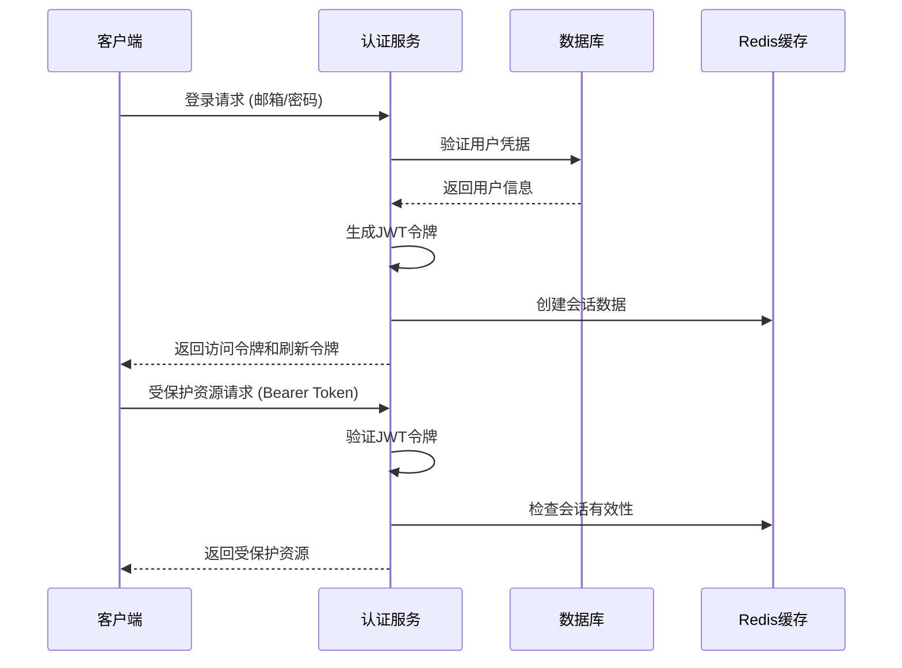
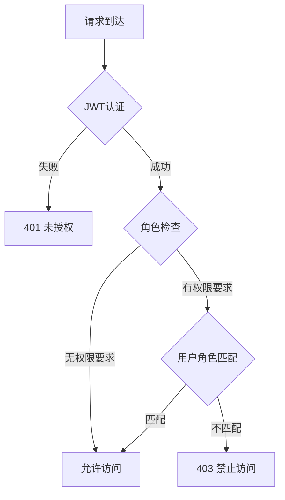
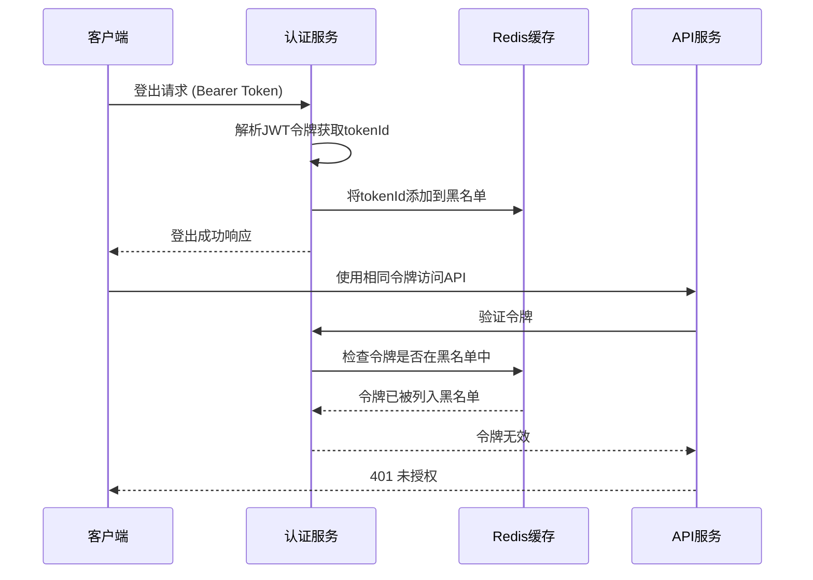
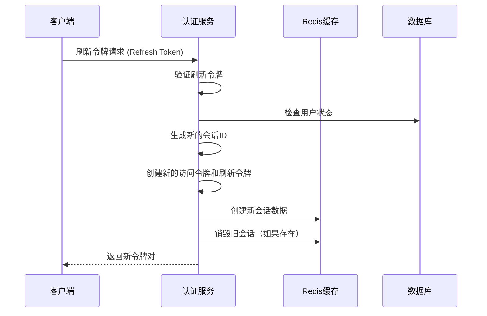

# 认证授权模块

## 概述

认证授权模块为NestJS Learning API实现了一个完整的基于JWT的认证系统和基于角色的授权控制（RBAC）。该模块提供了安全的用户认证、会话管理、权限控制和令牌管理功能，是整个应用程序安全架构的核心组件。

### 核心特性

- **JWT认证机制**: 基于JSON Web Token的无状态认证
- **基于角色的访问控制（RBAC）**: 支持用户、版主、管理员三级权限
- **安全密码存储**: 使用bcrypt算法进行密码哈希
- **令牌黑名单机制**: 支持令牌撤销和登出功能
- **刷新令牌支持**: 扩展会话管理和无缝令牌更新
- **会话管理**: 基于Redis的分布式会话存储
- **守卫和装饰器**: 简化的权限保护机制

### 技术栈

- **NestJS**: 核心框架和依赖注入
- **Passport**: 认证中间件和策略
- **JWT**: 令牌生成和验证
- **bcryptjs**: 密码哈希算法
- **TypeORM**: 用户数据持久化
- **Redis**: 会话存储和令牌黑名单
- **class-validator**: 数据验证

## 功能特性

### JWT认证流程

JWT认证是一种无状态的认证机制，通过在客户端存储签名的令牌来验证用户身份。

#### 实现原理

1. **用户登录**: 验证用户凭据（邮箱和密码）
2. **令牌生成**: 创建包含用户信息的JWT访问令牌和刷新令牌
3. **会话创建**: 在Redis中存储会话数据
4. **令牌验证**: 每次请求时验证JWT令牌的有效性
5. **会话检查**: 验证会话是否仍然有效且未被撤销

#### 认证流程图



### 基于角色的访问控制

RBAC系统提供了细粒度的权限控制，支持多层级的用户角色。

#### 角色层级

```typescript
export enum UserRole {
  USER = 'user',        // 普通用户 - 基础权限
  MODERATOR = 'moderator', // 版主 - 内容管理权限
  ADMIN = 'admin'       // 管理员 - 完整系统权限
}
```

#### 权限控制实现



### 令牌管理机制

#### 访问令牌 (Access Token)
- **有效期**: 1小时（可配置）
- **用途**: 访问受保护的API端点
- **存储**: 客户端内存或安全存储

#### 刷新令牌 (Refresh Token)
- **有效期**: 7天（可配置）
- **用途**: 获取新的访问令牌
- **存储**: 客户端安全存储

#### 令牌黑名单
- **实现**: Redis存储已撤销的令牌ID
- **用途**: 防止已登出令牌被重复使用
- **清理**: 自动过期清理机制

## 配置说明

### 环境变量配置

```bash
# JWT配置
JWT_SECRET=your-super-secret-jwt-key-min-32-chars
JWT_EXPIRES_IN=1h
JWT_REFRESH_SECRET=your-super-secret-refresh-key-min-32-chars
JWT_REFRESH_EXPIRES_IN=7d

# 数据库配置
DB_HOST=localhost
DB_PORT=3306
DB_USERNAME=root
DB_PASSWORD=password
DB_DATABASE=nestjs_learning

# Redis配置
REDIS_HOST=localhost
REDIS_PORT=6379
REDIS_PASSWORD=
```

### 模块配置选项

```typescript
// auth.module.ts
@Module({
  imports: [
    TypeOrmModule.forFeature([User]),
    PassportModule,
    JwtModule.registerAsync({
      imports: [ConfigModule],
      useFactory: async (configService: ConfigService) => ({
        secret: configService.get<string>('JWT_SECRET'),
        signOptions: {
          expiresIn: configService.get<string>('JWT_EXPIRES_IN') || '1h',
        },
      }),
      inject: [ConfigService],
    }),
  ],
  controllers: [AuthController],
  providers: [AuthService, JwtStrategy, LocalStrategy],
  exports: [AuthService],
})
export class AuthModule {}
```

### 依赖服务配置

认证模块依赖以下服务：

- **数据库**: 存储用户信息和凭据
- **Redis**: 会话管理和令牌黑名单
- **配置服务**: 管理JWT密钥和过期时间

## API接口

### POST /auth/register

用户注册接口，创建新的用户账户。

- **方法**: POST
- **路径**: `/auth/register`
- **描述**: 注册新用户并返回用户信息（不包含密码）

#### 请求格式

```typescript
interface RegisterDto {
  email: string;        // 用户邮箱（唯一）
  password: string;     // 密码（最少6位）
  firstName: string;    // 名字
  lastName: string;     // 姓氏
}
```

#### 响应格式

```typescript
interface RegisterResponse {
  id: string;
  email: string;
  firstName: string;
  lastName: string;
  role: UserRole;
  isActive: boolean;
  createdAt: Date;
  updatedAt: Date;
}
```

#### 错误码

- **409 Conflict**: 邮箱已存在
- **400 Bad Request**: 数据验证失败

### POST /auth/login

用户登录接口，验证凭据并返回JWT令牌。

- **方法**: POST
- **路径**: `/auth/login`
- **描述**: 验证用户凭据并返回访问令牌和刷新令牌

#### 请求格式

```typescript
interface LoginDto {
  email: string;     // 用户邮箱
  password: string;  // 用户密码
}
```

#### 响应格式

```typescript
interface AuthResponseDto {
  accessToken: string;   // JWT访问令牌
  refreshToken: string;  // JWT刷新令牌
  user: {
    id: string;
    email: string;
    firstName: string;
    lastName: string;
    role: UserRole;
  };
  expiresIn: number;     // 令牌过期时间（秒）
}
```

#### 错误码

- **401 Unauthorized**: 凭据无效或用户未激活
- **400 Bad Request**: 数据验证失败

### POST /auth/logout

用户登出接口，撤销当前令牌并清理会话。

- **方法**: POST
- **路径**: `/auth/logout`
- **描述**: 登出用户，将令牌加入黑名单并销毁会话
- **认证**: 需要Bearer Token

#### 请求格式

```typescript
// 请求头
Authorization: Bearer <access_token>
```

#### 响应格式

```typescript
interface LogoutResponse {
  message: string; // "Successfully logged out"
}
```

### POST /auth/refresh

刷新令牌接口，使用刷新令牌获取新的访问令牌。

- **方法**: POST
- **路径**: `/auth/refresh`
- **描述**: 使用有效的刷新令牌获取新的访问令牌和刷新令牌

#### 请求格式

```typescript
interface RefreshTokenDto {
  refreshToken: string; // 有效的刷新令牌
}
```

#### 响应格式

```typescript
interface AuthResponseDto {
  accessToken: string;   // 新的JWT访问令牌
  refreshToken: string;  // 新的JWT刷新令牌
  user: {
    id: string;
    email: string;
    firstName: string;
    lastName: string;
    role: UserRole;
  };
  expiresIn: number;     // 令牌过期时间（秒）
}
```

#### 错误码

- **401 Unauthorized**: 刷新令牌无效或已过期

### POST /auth/profile

获取当前用户资料接口。

- **方法**: POST
- **路径**: `/auth/profile`
- **描述**: 获取当前认证用户的详细信息
- **认证**: 需要Bearer Token

#### 请求格式

```typescript
// 请求头
Authorization: Bearer <access_token>
```

#### 响应格式

```typescript
interface UserProfile {
  id: string;
  email: string;
  firstName: string;
  lastName: string;
  role: UserRole;
  isActive: boolean;
  createdAt: Date;
  updatedAt: Date;
}
```

## 使用示例

### 基础认证保护

```typescript
import { Controller, Get, UseGuards } from '@nestjs/common';
import { JwtAuthGuard } from '../auth/guards/jwt-auth.guard';
import { CurrentUser } from '../auth/decorators/current-user.decorator';
import { User } from '../entities/user.entity';

@Controller('protected')
export class ProtectedController {
  @Get('profile')
  @UseGuards(JwtAuthGuard)
  getProfile(@CurrentUser() user: User) {
    // 只有认证用户可以访问
    return {
      message: `Hello ${user.firstName}!`,
      user: user
    };
  }
}
```

### 基于角色的权限控制

```typescript
import { Controller, Get, UseGuards } from '@nestjs/common';
import { JwtAuthGuard } from '../auth/guards/jwt-auth.guard';
import { RolesGuard } from '../auth/guards/roles.guard';
import { Roles } from '../auth/decorators/roles.decorator';
import { UserRole } from '../entities/user.entity';

@Controller('admin')
@UseGuards(JwtAuthGuard, RolesGuard)
export class AdminController {
  @Get('users')
  @Roles(UserRole.ADMIN)
  getAllUsers() {
    // 只有管理员可以访问
    return 'Admin only content';
  }

  @Get('moderate')
  @Roles(UserRole.ADMIN, UserRole.MODERATOR)
  moderateContent() {
    // 管理员和版主都可以访问
    return 'Moderation content';
  }

  @Get('dashboard')
  @Roles(UserRole.USER, UserRole.MODERATOR, UserRole.ADMIN)
  getDashboard(@CurrentUser() user: User) {
    // 所有认证用户都可以访问，但内容根据角色不同
    switch (user.role) {
      case UserRole.ADMIN:
        return { type: 'admin', data: 'Full admin dashboard' };
      case UserRole.MODERATOR:
        return { type: 'moderator', data: 'Moderation dashboard' };
      default:
        return { type: 'user', data: 'User dashboard' };
    }
  }
}
```

### 客户端认证流程

```typescript
// 认证服务客户端示例
class AuthClient {
  private accessToken: string | null = null;
  private refreshToken: string | null = null;

  async login(email: string, password: string) {
    const response = await fetch('/auth/login', {
      method: 'POST',
      headers: { 'Content-Type': 'application/json' },
      body: JSON.stringify({ email, password })
    });

    if (response.ok) {
      const data = await response.json();
      this.accessToken = data.accessToken;
      this.refreshToken = data.refreshToken;
      
      // 存储令牌到安全存储
      localStorage.setItem('refreshToken', this.refreshToken);
      return data.user;
    } else {
      throw new Error('Login failed');
    }
  }

  async makeAuthenticatedRequest(url: string, options: RequestInit = {}) {
    // 添加认证头
    const headers = {
      ...options.headers,
      'Authorization': `Bearer ${this.accessToken}`
    };

    let response = await fetch(url, { ...options, headers });

    // 如果令牌过期，尝试刷新
    if (response.status === 401 && this.refreshToken) {
      const refreshed = await this.refreshAccessToken();
      if (refreshed) {
        // 重试原始请求
        headers['Authorization'] = `Bearer ${this.accessToken}`;
        response = await fetch(url, { ...options, headers });
      }
    }

    return response;
  }

  async refreshAccessToken(): Promise<boolean> {
    try {
      const response = await fetch('/auth/refresh', {
        method: 'POST',
        headers: { 'Content-Type': 'application/json' },
        body: JSON.stringify({ refreshToken: this.refreshToken })
      });

      if (response.ok) {
        const data = await response.json();
        this.accessToken = data.accessToken;
        this.refreshToken = data.refreshToken;
        localStorage.setItem('refreshToken', this.refreshToken);
        return true;
      }
    } catch (error) {
      console.error('Token refresh failed:', error);
    }

    // 刷新失败，清理令牌并重定向到登录
    this.logout();
    return false;
  }

  async logout() {
    if (this.accessToken) {
      try {
        await fetch('/auth/logout', {
          method: 'POST',
          headers: { 'Authorization': `Bearer ${this.accessToken}` }
        });
      } catch (error) {
        console.error('Logout request failed:', error);
      }
    }

    // 清理本地存储
    this.accessToken = null;
    this.refreshToken = null;
    localStorage.removeItem('refreshToken');
  }
}
```

## 最佳实践

### 推荐使用方法

1. **令牌存储安全**
   ```typescript
   // ✅ 推荐：使用安全存储
   // 访问令牌存储在内存中
   // 刷新令牌存储在HttpOnly Cookie或安全存储中
   
   // ❌ 避免：将令牌存储在localStorage中（XSS风险）
   ```

2. **守卫组合使用**
   ```typescript
   // ✅ 推荐：正确的守卫顺序
   @UseGuards(JwtAuthGuard, RolesGuard)
   @Roles(UserRole.ADMIN)
   
   // ❌ 错误：颠倒守卫顺序
   @UseGuards(RolesGuard, JwtAuthGuard)
   ```

3. **错误处理**
   ```typescript
   // ✅ 推荐：优雅的错误处理
   try {
     const user = await this.authService.validateUser(email, password);
     if (!user) {
       throw new UnauthorizedException('Invalid credentials');
     }
   } catch (error) {
     // 记录错误但不暴露敏感信息
     this.logger.error('Authentication failed', error.stack);
     throw new UnauthorizedException('Authentication failed');
   }
   ```

### 性能优化建议

1. **会话缓存优化**
   ```typescript
   // 使用Redis管道操作减少网络往返
   const pipeline = this.redis.pipeline();
   pipeline.set(`session:${sessionId}`, sessionData);
   pipeline.expire(`session:${sessionId}`, ttl);
   await pipeline.exec();
   ```

2. **令牌验证缓存**
   ```typescript
   // 缓存用户信息减少数据库查询
   @Cacheable('user', 300) // 5分钟缓存
   async findUserById(id: string): Promise<User> {
     return this.userRepository.findOne({ where: { id } });
   }
   ```

3. **批量操作优化**
   ```typescript
   // 批量销毁用户会话
   async logoutAllSessions(userId: string): Promise<void> {
     const sessions = await this.getUserSessions(userId);
     const pipeline = this.redis.pipeline();
     sessions.forEach(sessionId => {
       pipeline.del(`session:${sessionId}`);
     });
     await pipeline.exec();
   }
   ```

### 安全注意事项

1. **密码安全**
   - 使用强密码策略（最少8位，包含大小写字母、数字和特殊字符）
   - 使用bcrypt进行密码哈希，盐值轮数至少10
   - 永远不要在日志或响应中暴露明文密码

2. **JWT安全**
   - 使用强随机密钥（至少32字符）
   - 设置合理的令牌过期时间
   - 实施令牌轮换机制
   - 验证令牌的issuer和audience

3. **会话安全**
   - 实施会话超时机制
   - 监控异常登录活动
   - 提供强制登出所有会话的功能
   - 定期清理过期会话数据

4. **API安全**
   - 实施速率限制防止暴力破解
   - 使用HTTPS传输敏感数据
   - 验证所有输入数据
   - 实施CORS策略

## 测试指南

### 单元测试示例

```typescript
// auth.service.spec.ts
describe('AuthService', () => {
  let service: AuthService;
  let userRepository: Repository<User>;
  let jwtService: JwtService;

  beforeEach(async () => {
    const module: TestingModule = await Test.createTestingModule({
      providers: [
        AuthService,
        {
          provide: getRepositoryToken(User),
          useClass: Repository,
        },
        {
          provide: JwtService,
          useValue: {
            sign: jest.fn(),
            verify: jest.fn(),
          },
        },
      ],
    }).compile();

    service = module.get<AuthService>(AuthService);
    userRepository = module.get<Repository<User>>(getRepositoryToken(User));
    jwtService = module.get<JwtService>(JwtService);
  });

  describe('validateUser', () => {
    it('should return user when credentials are valid', async () => {
      const user = {
        id: '1',
        email: 'test@example.com',
        password: await bcrypt.hash('password', 10),
      } as User;

      jest.spyOn(userRepository, 'findOne').mockResolvedValue(user);
      jest.spyOn(bcrypt, 'compare').mockResolvedValue(true);

      const result = await service.validateUser('test@example.com', 'password');
      expect(result).toEqual(user);
    });

    it('should return null when credentials are invalid', async () => {
      jest.spyOn(userRepository, 'findOne').mockResolvedValue(null);

      const result = await service.validateUser('test@example.com', 'wrong');
      expect(result).toBeNull();
    });
  });
});
```

### 集成测试方法

```typescript
// auth.controller.e2e-spec.ts
describe('AuthController (e2e)', () => {
  let app: INestApplication;

  beforeEach(async () => {
    const moduleFixture: TestingModule = await Test.createTestingModule({
      imports: [AppModule],
    }).compile();

    app = moduleFixture.createNestApplication();
    await app.init();
  });

  describe('/auth/login (POST)', () => {
    it('should login successfully with valid credentials', () => {
      return request(app.getHttpServer())
        .post('/auth/login')
        .send({
          email: 'test@example.com',
          password: 'password123'
        })
        .expect(200)
        .expect((res) => {
          expect(res.body).toHaveProperty('accessToken');
          expect(res.body).toHaveProperty('refreshToken');
          expect(res.body).toHaveProperty('user');
        });
    });

    it('should return 401 for invalid credentials', () => {
      return request(app.getHttpServer())
        .post('/auth/login')
        .send({
          email: 'test@example.com',
          password: 'wrongpassword'
        })
        .expect(401);
    });
  });

  describe('/auth/profile (POST)', () => {
    it('should return user profile when authenticated', async () => {
      // 先登录获取令牌
      const loginResponse = await request(app.getHttpServer())
        .post('/auth/login')
        .send({
          email: 'test@example.com',
          password: 'password123'
        });

      const { accessToken } = loginResponse.body;

      return request(app.getHttpServer())
        .post('/auth/profile')
        .set('Authorization', `Bearer ${accessToken}`)
        .expect(200)
        .expect((res) => {
          expect(res.body).toHaveProperty('id');
          expect(res.body).toHaveProperty('email');
        });
    });

    it('should return 401 when not authenticated', () => {
      return request(app.getHttpServer())
        .post('/auth/profile')
        .expect(401);
    });
  });
});
```

### 性能测试建议

```typescript
// 负载测试示例
describe('Auth Performance Tests', () => {
  it('should handle concurrent login requests', async () => {
    const concurrentRequests = 100;
    const promises = Array.from({ length: concurrentRequests }, (_, i) =>
      request(app.getHttpServer())
        .post('/auth/login')
        .send({
          email: `user${i}@example.com`,
          password: 'password123'
        })
    );

    const startTime = Date.now();
    const results = await Promise.all(promises);
    const endTime = Date.now();

    const successfulRequests = results.filter(res => res.status === 200);
    const averageResponseTime = (endTime - startTime) / concurrentRequests;

    expect(successfulRequests.length).toBeGreaterThan(concurrentRequests * 0.95);
    expect(averageResponseTime).toBeLessThan(1000); // 平均响应时间小于1秒
  });
});
```

## 故障排除

### 常见问题解答

**Q: JWT令牌验证失败，返回401错误**

A: 检查以下几点：
1. 确认JWT_SECRET环境变量设置正确
2. 检查令牌是否已过期
3. 验证Authorization头格式：`Bearer <token>`
4. 确认用户账户状态为激活状态

**Q: 角色权限检查不生效**

A: 确保守卫使用顺序正确：
```typescript
// 正确顺序
@UseGuards(JwtAuthGuard, RolesGuard)
@Roles(UserRole.ADMIN)
```

**Q: 刷新令牌失败**

A: 检查：
1. 刷新令牌是否已过期
2. JWT_REFRESH_SECRET配置是否正确
3. 用户账户是否仍然激活

### 错误处理方法

```typescript
// 全局异常过滤器
@Catch()
export class AuthExceptionFilter implements ExceptionFilter {
  catch(exception: any, host: ArgumentsHost) {
    const ctx = host.switchToHttp();
    const response = ctx.getResponse();
    const request = ctx.getRequest();

    let status = HttpStatus.INTERNAL_SERVER_ERROR;
    let message = 'Internal server error';

    if (exception instanceof UnauthorizedException) {
      status = HttpStatus.UNAUTHORIZED;
      message = 'Authentication failed';
    } else if (exception instanceof ForbiddenException) {
      status = HttpStatus.FORBIDDEN;
      message = 'Insufficient permissions';
    }

    response.status(status).json({
      statusCode: status,
      timestamp: new Date().toISOString(),
      path: request.url,
      message,
    });
  }
}
```

### 调试技巧

1. **启用详细日志**
   ```typescript
   // 在开发环境启用JWT调试
   if (process.env.NODE_ENV === 'development') {
     console.log('JWT Payload:', payload);
     console.log('User from DB:', user);
   }
   ```

2. **监控认证指标**
   ```typescript
   // 添加认证指标收集
   @Injectable()
   export class AuthMetrics {
     private loginAttempts = 0;
     private successfulLogins = 0;
     private failedLogins = 0;

     recordLoginAttempt() {
       this.loginAttempts++;
     }

     recordSuccessfulLogin() {
       this.successfulLogins++;
     }

     recordFailedLogin() {
       this.failedLogins++;
     }

     getMetrics() {
       return {
         total: this.loginAttempts,
         successful: this.successfulLogins,
         failed: this.failedLogins,
         successRate: this.successfulLogins / this.loginAttempts
       };
     }
   }
   ```

3. **令牌调试工具**
   ```typescript
   // JWT令牌解析工具
   debugToken(token: string) {
     try {
       const decoded = this.jwtService.decode(token);
       console.log('Token payload:', decoded);
       console.log('Token expires at:', new Date(decoded.exp * 1000));
       console.log('Token issued at:', new Date(decoded.iat * 1000));
     } catch (error) {
       console.error('Token decode failed:', error);
     }
   }
   ```

## 安全机制详解

### 令牌黑名单机制

令牌黑名单是一种安全机制，用于在用户登出或令牌被撤销时防止已签发的JWT令牌继续被使用。

#### 实现原理



#### 黑名单存储结构

```typescript
// Redis中的黑名单存储格式
interface BlacklistEntry {
  blacklistedAt: string;  // 加入黑名单的时间
}

// 存储键格式: blacklist:{tokenId}
// 示例: blacklist:abcdefgh-1234-5678-90ab-cdefghijk901
```

#### 自动清理机制

```typescript
async blacklistToken(tokenId: string, expirationTime: Date): Promise<void> {
  const now = new Date();
  // 计算令牌剩余有效时间
  const ttl = Math.max(0, Math.floor((expirationTime.getTime() - now.getTime()) / 1000));
  
  if (ttl > 0) {
    // 设置与令牌过期时间相同的TTL，自动清理过期的黑名单条目
    await this.cacheService.set(
      tokenId,
      { blacklistedAt: now.toISOString() },
      { ttl, prefix: 'blacklist' }
    );
  }
}
```

### 令牌刷新流程

令牌刷新机制允许客户端在访问令牌过期时获取新的令牌，而无需重新登录。

#### 刷新流程图



#### 令牌轮换策略

```typescript
async refreshToken(refreshToken: string): Promise<AuthResponseDto> {
  // 1. 验证刷新令牌
  const payload = this.jwtService.verify(refreshToken);
  
  // 2. 检查用户状态
  const user = await this.userRepository.findOne({ where: { id: payload.sub } });
  if (!user || !user.isActive) {
    throw new UnauthorizedException('User not found or inactive');
  }

  // 3. 生成新的会话ID（令牌轮换）
  const newSessionId = uuidv4();
  const newPayload = { 
    email: user.email, 
    sub: user.id, 
    role: user.role,
    sessionId: newSessionId 
  };
  
  // 4. 创建新令牌对
  const accessToken = this.jwtService.sign(newPayload);
  const newRefreshToken = this.jwtService.sign(newPayload, { expiresIn: '7d' });

  // 5. 创建新会话并销毁旧会话
  await this.sessionService.createSession(newSessionId, sessionData);
  if (payload.sessionId) {
    await this.sessionService.destroySession(payload.sessionId);
  }

  return { accessToken, refreshToken: newRefreshToken, user, expiresIn: 3600 };
}
```

### 会话管理机制

会话管理提供了分布式环境下的用户状态跟踪和安全控制。

#### 会话数据结构

```typescript
interface SessionData {
  userId: string;        // 用户ID
  email: string;         // 用户邮箱
  role: string;          // 用户角色
  loginTime: Date;       // 登录时间
  lastActivity: Date;    // 最后活动时间
  ipAddress?: string;    // 登录IP地址
  userAgent?: string;    // 用户代理信息
}
```

#### 滑动过期机制

```typescript
async updateActivity(sessionId: string, options: SessionOptions = {}): Promise<void> {
  const session = await this.getSession(sessionId);
  if (!session) {
    throw new Error('Session not found');
  }

  // 更新最后活动时间
  session.lastActivity = new Date();

  // 滑动过期：每次活动时延长会话时间
  const ttl = options.slidingExpiration 
    ? (options.ttl || this.defaultSlidingWindow)  // 30分钟滑动窗口
    : undefined;

  await this.cacheService.set(sessionId, session, { ttl, prefix: 'session' });
}
```

#### 多设备会话管理

```typescript
// 获取用户所有活动会话
async getUserSessions(userId: string): Promise<string[]> {
  const pattern = '*';
  const keys = await this.cacheService.keys(pattern, 'session');
  const sessions: string[] = [];

  for (const key of keys) {
    const sessionId = key.split(':').pop();
    if (sessionId) {
      const session = await this.getSession(sessionId);
      if (session && session.userId === userId) {
        sessions.push(sessionId);
      }
    }
  }

  return sessions;
}

// 强制登出所有设备
async logoutAllSessions(userId: string): Promise<void> {
  const sessions = await this.getUserSessions(userId);
  
  for (const sessionId of sessions) {
    await this.destroySession(sessionId);
  }
}
```

### 密码安全机制

#### 密码哈希策略

```typescript
import * as bcrypt from 'bcryptjs';

// 注册时的密码哈希
async register(registerDto: RegisterDto): Promise<User> {
  // 使用盐值轮数10进行哈希（推荐值）
  const hashedPassword = await bcrypt.hash(registerDto.password, 10);
  
  const user = this.userRepository.create({
    ...registerDto,
    password: hashedPassword,  // 存储哈希后的密码
  });

  return this.userRepository.save(user);
}

// 登录时的密码验证
async validateUser(email: string, password: string): Promise<User | null> {
  const user = await this.userRepository.findOne({ where: { email } });
  
  // 使用bcrypt比较明文密码和哈希密码
  if (user && await bcrypt.compare(password, user.password)) {
    return user;
  }
  
  return null;
}
```

#### 密码强度要求

```typescript
// 密码验证规则
export class RegisterDto {
  @IsEmail()
  email: string;

  @IsString()
  @MinLength(8, { message: '密码至少需要8个字符' })
  @Matches(/^(?=.*[a-z])(?=.*[A-Z])(?=.*\d)(?=.*[@$!%*?&])[A-Za-z\d@$!%*?&]/, {
    message: '密码必须包含至少一个大写字母、一个小写字母、一个数字和一个特殊字符'
  })
  password: string;

  @IsString()
  firstName: string;

  @IsString()
  lastName: string;
}
```

### JWT安全配置

#### 令牌签名和验证

```typescript
// JWT模块配置
JwtModule.registerAsync({
  imports: [ConfigModule],
  useFactory: async (configService: ConfigService) => ({
    secret: configService.get<string>('JWT_SECRET'),  // 强随机密钥
    signOptions: {
      expiresIn: configService.get<string>('JWT_EXPIRES_IN') || '1h',
      issuer: 'nestjs-learning-api',      // 签发者
      audience: 'nestjs-learning-client', // 受众
      algorithm: 'HS256',                 // 签名算法
    },
  }),
  inject: [ConfigService],
})
```

#### 令牌载荷结构

```typescript
interface JwtPayload {
  email: string;      // 用户邮箱
  sub: string;        // 用户ID（主题）
  role: UserRole;     // 用户角色
  sessionId: string;  // 会话ID
  iat: number;        // 签发时间
  exp: number;        // 过期时间
  iss: string;        // 签发者
  aud: string;        // 受众
}
```

### 安全最佳实践

#### 1. 环境变量安全

```bash
# 生产环境配置示例
JWT_SECRET=your-super-secret-jwt-key-at-least-32-characters-long
JWT_REFRESH_SECRET=your-super-secret-refresh-key-different-from-access-secret
JWT_EXPIRES_IN=15m          # 短期访问令牌
JWT_REFRESH_EXPIRES_IN=7d   # 长期刷新令牌

# 数据库连接加密
DB_SSL=true
DB_SSL_REJECT_UNAUTHORIZED=true

# Redis连接安全
REDIS_PASSWORD=your-redis-password
REDIS_TLS=true
```

#### 2. 速率限制配置

```typescript
// 认证端点速率限制
@Controller('auth')
@UseGuards(ThrottlerGuard)
export class AuthController {
  @Throttle(5, 900)  // 15分钟内最多5次登录尝试
  @Post('login')
  async login(@Body() loginDto: LoginDto) {
    return this.authService.login(loginDto);
  }

  @Throttle(3, 3600) // 1小时内最多3次注册尝试
  @Post('register')
  async register(@Body() registerDto: RegisterDto) {
    return this.authService.register(registerDto);
  }
}
```

#### 3. 安全头配置

```typescript
// 安全中间件配置
app.use(helmet({
  contentSecurityPolicy: {
    directives: {
      defaultSrc: ["'self'"],
      styleSrc: ["'self'", "'unsafe-inline'"],
      scriptSrc: ["'self'"],
      imgSrc: ["'self'", "data:", "https:"],
    },
  },
  hsts: {
    maxAge: 31536000,
    includeSubDomains: true,
    preload: true
  }
}));

// CORS配置
app.enableCors({
  origin: process.env.ALLOWED_ORIGINS?.split(',') || ['http://localhost:3000'],
  credentials: true,
  methods: ['GET', 'POST', 'PUT', 'DELETE', 'OPTIONS'],
  allowedHeaders: ['Content-Type', 'Authorization'],
});
```

#### 4. 日志和监控

```typescript
// 安全事件日志记录
@Injectable()
export class SecurityLogger {
  private readonly logger = new Logger(SecurityLogger.name);

  logSuccessfulLogin(userId: string, ipAddress: string, userAgent: string) {
    this.logger.log(`Successful login: User ${userId} from ${ipAddress}`, {
      event: 'LOGIN_SUCCESS',
      userId,
      ipAddress,
      userAgent,
      timestamp: new Date().toISOString()
    });
  }

  logFailedLogin(email: string, ipAddress: string, reason: string) {
    this.logger.warn(`Failed login attempt: ${email} from ${ipAddress} - ${reason}`, {
      event: 'LOGIN_FAILED',
      email,
      ipAddress,
      reason,
      timestamp: new Date().toISOString()
    });
  }

  logSuspiciousActivity(userId: string, activity: string, details: any) {
    this.logger.error(`Suspicious activity: User ${userId} - ${activity}`, {
      event: 'SUSPICIOUS_ACTIVITY',
      userId,
      activity,
      details,
      timestamp: new Date().toISOString()
    });
  }
}
```

#### 5. 输入验证和清理

```typescript
// 全局验证管道
app.useGlobalPipes(new ValidationPipe({
  whitelist: true,           // 只保留DTO中定义的属性
  forbidNonWhitelisted: true, // 拒绝未定义的属性
  transform: true,           // 自动类型转换
  disableErrorMessages: process.env.NODE_ENV === 'production', // 生产环境隐藏详细错误
}));

// SQL注入防护（TypeORM自动处理）
// XSS防护
import { escape } from 'html-escaper';

@Transform(({ value }) => escape(value))
@IsString()
firstName: string;
```

#### 6. 会话安全配置

```typescript
// 会话安全选项
const sessionOptions: SessionOptions = {
  ttl: 30 * 60,              // 30分钟基础TTL
  slidingExpiration: true,    // 启用滑动过期
  maxConcurrentSessions: 5,   // 每用户最大并发会话数
  detectConcurrentLogin: true, // 检测并发登录
  forceLogoutOnSuspicious: true, // 可疑活动时强制登出
};
```

## 相关资源

- [NestJS认证官方文档](https://docs.nestjs.com/security/authentication)
- [Passport.js策略文档](http://www.passportjs.org/docs/)
- [JWT最佳实践指南](https://auth0.com/blog/a-look-at-the-latest-draft-for-jwt-bcp/)
- [OWASP认证备忘单](https://cheatsheetseries.owasp.org/cheatsheets/Authentication_Cheat_Sheet.html)
- [bcrypt密码哈希指南](https://github.com/kelektiv/node.bcrypt.js)
- [Redis安全配置指南](https://redis.io/topics/security)
- [NestJS安全最佳实践](https://docs.nestjs.com/security/helmet)