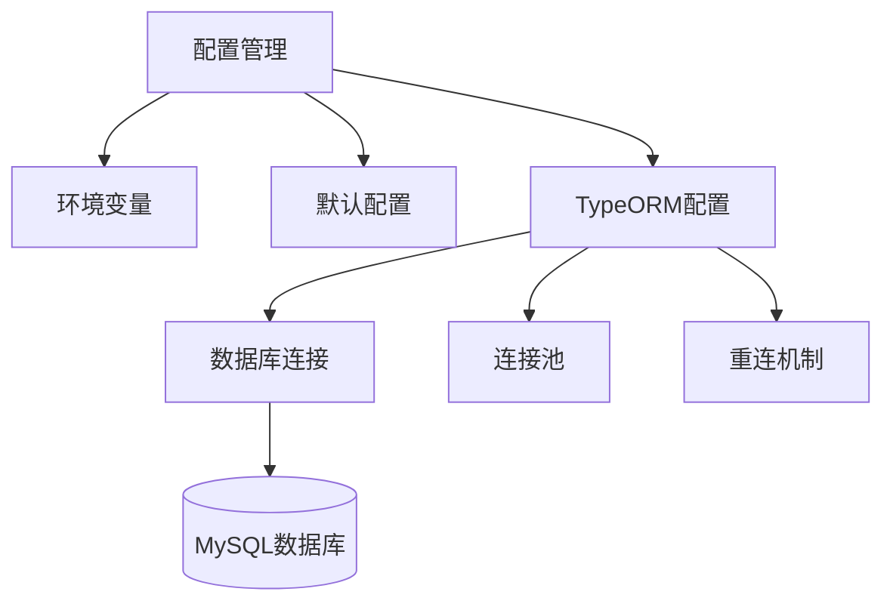
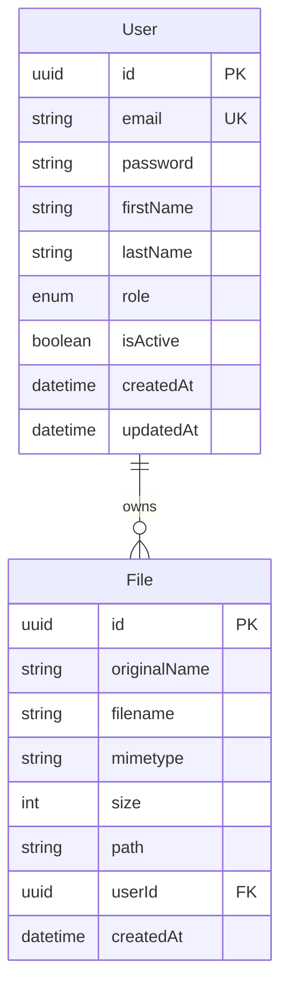
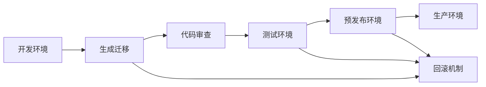

# 数据库模块

## 概述

数据库模块是NestJS学习API项目的核心数据持久化层，基于TypeORM和MySQL实现。该模块提供了完整的数据库连接管理、实体定义、关系映射、迁移管理和查询优化功能，为整个应用程序提供可靠的数据存储和访问服务。

### 核心特性

- **MySQL数据库集成**: 使用MySQL作为主数据库，支持高性能的关系型数据存储
- **TypeORM ORM框架**: 基于TypeORM实现对象关系映射，提供类型安全的数据库操作
- **实体关系映射**: 支持一对一、一对多、多对多等复杂关系映射
- **数据库迁移**: 完整的数据库版本控制和迁移管理系统
- **种子数据**: 自动化的测试数据生成和加载机制
- **查询优化**: 提供查询构建器和性能优化最佳实践
- **连接池管理**: 智能的数据库连接池管理和重连机制

### 技术栈

- **数据库**: MySQL 8.0+
- **ORM框架**: TypeORM 0.3.x
- **连接驱动**: mysql2
- **迁移工具**: TypeORM CLI
- **类型验证**: class-validator + class-transformer

## 功能特性

### 1. 数据库连接配置

数据库模块采用灵活的配置管理方式，支持多环境配置和动态连接参数：



### 2. 实体定义和装饰器

使用TypeORM装饰器定义数据库实体，支持完整的元数据配置：

- **@Entity**: 定义数据库表映射
- **@PrimaryGeneratedColumn**: 主键自动生成
- **@Column**: 字段定义和约束
- **@CreateDateColumn/@UpdateDateColumn**: 自动时间戳
- **@OneToMany/@ManyToOne**: 关系映射
- **@JoinColumn**: 外键关联

### 3. 关系映射系统

支持完整的关系型数据库关系映射：



### 4. 迁移管理

完整的数据库版本控制系统，支持：
- 自动迁移生成
- 迁移执行和回滚
- 数据库结构同步
- 生产环境安全部署

### 5. 种子数据系统

自动化的测试数据生成和管理：
- 初始用户数据创建
- 角色权限数据初始化
- 开发环境数据填充
- 测试数据隔离

## 配置说明

### 环境变量配置

数据库连接需要以下环境变量配置：

```bash
# 数据库连接配置
DB_HOST=localhost          # 数据库主机地址
DB_PORT=3306              # 数据库端口
DB_USERNAME=root          # 数据库用户名
DB_PASSWORD=password      # 数据库密码
DB_DATABASE=nestjs_learning_api  # 数据库名称

# 环境配置
NODE_ENV=development      # 运行环境 (development/production/test)
```

### 数据库配置文件

`src/config/database.config.ts` 提供了完整的数据库配置管理：

```typescript
import { registerAs } from '@nestjs/config'
import { DataSource, DataSourceOptions } from 'typeorm'

export const databaseConfig = registerAs('database', () => ({
  type: 'mysql',
  host: process.env.DB_HOST || 'localhost',
  port: parseInt(process.env.DB_PORT) || 3306,
  username: process.env.DB_USERNAME || 'root',
  password: process.env.DB_PASSWORD || 'password',
  database: process.env.DB_DATABASE || 'nestjs_learning_api',
  entities: [__dirname + '/../**/*.entity{.ts,.js}'],
  migrations: [__dirname + '/../migrations/*{.ts,.js}'],
  synchronize: process.env.NODE_ENV === 'development',
  logging: process.env.NODE_ENV === 'development',
}))
```

### TypeORM模块配置

在 `app.module.ts` 中的TypeORM配置：

```typescript
TypeOrmModule.forRootAsync({
  useFactory: () => ({
    type: 'mysql',
    host: process.env.DB_HOST || 'localhost',
    port: parseInt(process.env.DB_PORT) || 3306,
    username: process.env.DB_USERNAME || 'root',
    password: process.env.DB_PASSWORD || 'password',
    database: process.env.DB_DATABASE || 'nestjs_learning_api',
    entities: [__dirname + '/**/*.entity{.ts,.js}'],
    migrations: [__dirname + '/migrations/*{.ts,.js}'],
    synchronize: process.env.NODE_ENV === 'development',
    logging: process.env.NODE_ENV === 'development',
    retryAttempts: 3,        // 连接重试次数
    retryDelay: 3000,        // 重试延迟时间
  }),
})
```

### 配置参数说明

| 参数 | 说明 | 开发环境 | 生产环境 |
|------|------|----------|----------|
| `synchronize` | 自动同步数据库结构 | `true` | `false` |
| `logging` | 启用SQL日志 | `true` | `false` |
| `retryAttempts` | 连接重试次数 | `3` | `5` |
| `retryDelay` | 重试延迟(ms) | `3000` | `5000` |

## 实体定义

### User实体

用户实体是系统的核心实体，包含完整的用户信息和权限管理：

```typescript
import {
  Entity,
  PrimaryGeneratedColumn,
  Column,
  CreateDateColumn,
  UpdateDateColumn,
  OneToMany,
} from 'typeorm'
import { File } from './file.entity'

export enum UserRole {
  USER = 'user',
  ADMIN = 'admin',
  MODERATOR = 'moderator',
}

@Entity('users')
export class User {
  @PrimaryGeneratedColumn('uuid')
  id: string

  @Column({ unique: true })
  email: string

  @Column()
  password: string

  @Column()
  firstName: string

  @Column()
  lastName: string

  @Column({ type: 'enum', enum: UserRole, default: UserRole.USER })
  role: UserRole

  @Column({ default: true })
  isActive: boolean

  @CreateDateColumn()
  createdAt: Date

  @UpdateDateColumn()
  updatedAt: Date

  @OneToMany(() => File, (file) => file.user)
  files: File[]
}
```

#### 装饰器详解

- **@Entity('users')**: 指定数据库表名为 `users`
- **@PrimaryGeneratedColumn('uuid')**: 使用UUID作为主键，自动生成
- **@Column({ unique: true })**: 创建唯一约束，确保邮箱唯一性
- **@Column({ type: 'enum', enum: UserRole, default: UserRole.USER })**: 枚举类型字段，设置默认值
- **@Column({ default: true })**: 布尔类型字段，设置默认值
- **@CreateDateColumn()**: 自动设置创建时间
- **@UpdateDateColumn()**: 自动更新修改时间
- **@OneToMany(() => File, (file) => file.user)**: 一对多关系，一个用户可以拥有多个文件

### File实体

文件实体用于管理用户上传的文件信息：

```typescript
import {
  Entity,
  PrimaryGeneratedColumn,
  Column,
  CreateDateColumn,
  ManyToOne,
  JoinColumn,
} from 'typeorm'
import { User } from './user.entity'

@Entity('files')
export class File {
  @PrimaryGeneratedColumn('uuid')
  id: string

  @Column()
  originalName: string

  @Column()
  filename: string

  @Column()
  mimetype: string

  @Column()
  size: number

  @Column()
  path: string

  @ManyToOne(() => User, (user) => user.files)
  @JoinColumn({ name: 'userId' })
  user: User

  @Column()
  userId: string

  @CreateDateColumn()
  createdAt: Date
}
```

#### 关系映射详解

- **@ManyToOne(() => User, (user) => user.files)**: 多对一关系，多个文件属于一个用户
- **@JoinColumn({ name: 'userId' })**: 指定外键字段名为 `userId`
- **userId字段**: 显式定义外键字段，便于查询和索引

### 实体索引文件

`src/entities/index.ts` 提供统一的实体导出：

```typescript
export { User, UserRole } from './user.entity'
export { File } from './file.entity'
```

## 种子数据系统

### 种子数据脚本

`src/seeds/seed.ts` 提供了完整的测试数据生成功能：

```typescript
import { DataSource } from 'typeorm'
import { User, UserRole } from '../entities/user.entity'
import { dataSourceOptions } from '../config/database.config'
import * as bcrypt from 'bcryptjs'

async function seed() {
  const dataSource = new DataSource(dataSourceOptions)
  
  try {
    await dataSource.initialize()
    console.log('Database connection established')

    const userRepository = dataSource.getRepository(User)

    // 检查是否已存在用户数据
    const existingUsers = await userRepository.count()
    if (existingUsers > 0) {
      console.log('Seed data already exists, skipping...')
      return
    }

    // 创建管理员用户
    const adminUser = userRepository.create({
      email: 'admin@example.com',
      password: await bcrypt.hash('admin123', 10),
      firstName: 'Admin',
      lastName: 'User',
      role: UserRole.ADMIN,
      isActive: true,
    })

    // 创建普通用户
    const regularUser = userRepository.create({
      email: 'user@example.com',
      password: await bcrypt.hash('user123', 10),
      firstName: 'Regular',
      lastName: 'User',
      role: UserRole.USER,
      isActive: true,
    })

    // 创建版主用户
    const moderatorUser = userRepository.create({
      email: 'moderator@example.com',
      password: await bcrypt.hash('moderator123', 10),
      firstName: 'Moderator',
      lastName: 'User',
      role: UserRole.MODERATOR,
      isActive: true,
    })

    await userRepository.save([adminUser, regularUser, moderatorUser])
    console.log('Seed data created successfully')

  } catch (error) {
    console.error('Error seeding database:', error)
  } finally {
    await dataSource.destroy()
  }
}
```

### 种子数据特性

1. **重复执行保护**: 检查现有数据，避免重复创建
2. **密码加密**: 使用bcrypt对密码进行安全加密
3. **多角色用户**: 创建不同权限级别的测试用户
4. **错误处理**: 完整的异常处理和资源清理
5. **连接管理**: 自动管理数据库连接的创建和销毁

### 执行种子数据

```bash
# 执行种子数据脚本
npm run seed

# 输出示例
Database connection established
Seed data created successfully
Created users:
- Admin: admin@example.com / admin123
- User: user@example.com / user123
- Moderator: moderator@example.com / moderator123
```

## 使用示例

### 基础数据库操作

```typescript
import { Injectable } from '@nestjs/common'
import { InjectRepository } from '@nestjs/typeorm'
import { Repository } from 'typeorm'
import { User } from '../entities/user.entity'

@Injectable()
export class UserService {
  constructor(
    @InjectRepository(User)
    private userRepository: Repository<User>,
  ) {}

  // 创建用户
  async createUser(userData: Partial<User>): Promise<User> {
    const user = this.userRepository.create(userData)
    return await this.userRepository.save(user)
  }

  // 查找用户（包含关联文件）
  async findUserWithFiles(id: string): Promise<User> {
    return await this.userRepository.findOne({
      where: { id },
      relations: ['files'],
    })
  }

  // 分页查询用户
  async findUsers(page: number, limit: number): Promise<[User[], number]> {
    return await this.userRepository.findAndCount({
      skip: (page - 1) * limit,
      take: limit,
      order: { createdAt: 'DESC' },
    })
  }
}
```

### 复杂查询示例

```typescript
// 使用查询构建器进行复杂查询
async findActiveUsersWithFiles(): Promise<User[]> {
  return await this.userRepository
    .createQueryBuilder('user')
    .leftJoinAndSelect('user.files', 'file')
    .where('user.isActive = :isActive', { isActive: true })
    .andWhere('user.role IN (:...roles)', { roles: ['user', 'moderator'] })
    .orderBy('user.createdAt', 'DESC')
    .getMany()
}

// 统计查询
async getUserStats(): Promise<any> {
  return await this.userRepository
    .createQueryBuilder('user')
    .select([
      'user.role',
      'COUNT(user.id) as count',
      'AVG(file.size) as avgFileSize'
    ])
    .leftJoin('user.files', 'file')
    .groupBy('user.role')
    .getRawMany()
}
```

### 事务处理

```typescript
import { DataSource } from 'typeorm'

@Injectable()
export class UserService {
  constructor(private dataSource: DataSource) {}

  async createUserWithFile(userData: Partial<User>, fileData: Partial<File>): Promise<User> {
    const queryRunner = this.dataSource.createQueryRunner()
    
    await queryRunner.connect()
    await queryRunner.startTransaction()
    
    try {
      // 创建用户
      const user = queryRunner.manager.create(User, userData)
      const savedUser = await queryRunner.manager.save(user)
      
      // 创建文件
      const file = queryRunner.manager.create(File, {
        ...fileData,
        userId: savedUser.id,
      })
      await queryRunner.manager.save(file)
      
      await queryRunner.commitTransaction()
      return savedUser
      
    } catch (error) {
      await queryRunner.rollbackTransaction()
      throw error
    } finally {
      await queryRunner.release()
    }
  }
}
```

## 最佳实践

### 1. 实体设计最佳实践

```typescript
// ✅ 推荐：使用明确的字段类型和约束
@Entity('products')
export class Product {
  @PrimaryGeneratedColumn('uuid')
  id: string

  @Column({ length: 100, nullable: false })
  name: string

  @Column({ type: 'decimal', precision: 10, scale: 2 })
  price: number

  @Column({ type: 'text', nullable: true })
  description: string

  @Index() // 为经常查询的字段添加索引
  @Column()
  categoryId: string

  @CreateDateColumn()
  createdAt: Date

  @UpdateDateColumn()
  updatedAt: Date
}

// ❌ 避免：缺少约束和索引的实体定义
@Entity()
export class BadProduct {
  @PrimaryGeneratedColumn()
  id: number

  @Column()
  name: string // 缺少长度限制

  @Column()
  price: string // 错误的数据类型

  // 缺少时间戳字段
}
```

### 2. 查询优化最佳实践

```typescript
// ✅ 推荐：使用索引和适当的查询条件
async findUsersByRole(role: UserRole, limit: number = 10): Promise<User[]> {
  return await this.userRepository.find({
    where: { role, isActive: true },
    take: limit,
    order: { createdAt: 'DESC' },
    select: ['id', 'email', 'firstName', 'lastName', 'role'], // 只选择需要的字段
  })
}

// ✅ 推荐：使用查询构建器进行复杂查询
async findUsersWithFileCount(): Promise<any[]> {
  return await this.userRepository
    .createQueryBuilder('user')
    .select([
      'user.id',
      'user.email',
      'user.firstName',
      'user.lastName',
      'COUNT(file.id) as fileCount'
    ])
    .leftJoin('user.files', 'file')
    .groupBy('user.id')
    .having('COUNT(file.id) > :minFiles', { minFiles: 0 })
    .getRawMany()
}

// ❌ 避免：N+1查询问题
async getBadUserFiles(): Promise<User[]> {
  const users = await this.userRepository.find()
  for (const user of users) {
    user.files = await this.fileRepository.find({ where: { userId: user.id } })
  }
  return users
}
```

### 3. 关系映射最佳实践

```typescript
// ✅ 推荐：合理使用关系加载策略
@Entity('orders')
export class Order {
  @PrimaryGeneratedColumn('uuid')
  id: string

  @ManyToOne(() => User, { eager: false }) // 不自动加载，按需加载
  @JoinColumn({ name: 'userId' })
  user: User

  @OneToMany(() => OrderItem, item => item.order, { 
    cascade: true, // 级联操作
    lazy: true     // 懒加载
  })
  items: OrderItem[]
}

// 查询时明确指定需要的关系
async findOrderWithDetails(id: string): Promise<Order> {
  return await this.orderRepository.findOne({
    where: { id },
    relations: ['user', 'items'], // 明确指定需要加载的关系
  })
}
```

### 4. 数据验证最佳实践

```typescript
import { IsEmail, IsEnum, IsNotEmpty, Length } from 'class-validator'

// ✅ 推荐：在DTO中进行数据验证
export class CreateUserDto {
  @IsEmail({}, { message: '请提供有效的邮箱地址' })
  email: string

  @IsNotEmpty({ message: '密码不能为空' })
  @Length(6, 20, { message: '密码长度必须在6-20个字符之间' })
  password: string

  @IsNotEmpty({ message: '名字不能为空' })
  @Length(1, 50, { message: '名字长度不能超过50个字符' })
  firstName: string

  @IsNotEmpty({ message: '姓氏不能为空' })
  @Length(1, 50, { message: '姓氏长度不能超过50个字符' })
  lastName: string

  @IsEnum(UserRole, { message: '无效的用户角色' })
  role: UserRole
}
```

### 5. 错误处理最佳实践

```typescript
import { ConflictException, NotFoundException } from '@nestjs/common'

@Injectable()
export class UserService {
  async createUser(createUserDto: CreateUserDto): Promise<User> {
    try {
      const user = this.userRepository.create(createUserDto)
      return await this.userRepository.save(user)
    } catch (error) {
      if (error.code === 'ER_DUP_ENTRY') {
        throw new ConflictException('邮箱地址已被使用')
      }
      throw error
    }
  }

  async findUserById(id: string): Promise<User> {
    const user = await this.userRepository.findOne({ where: { id } })
    if (!user) {
      throw new NotFoundException(`ID为 ${id} 的用户不存在`)
    }
    return user
  }
}
```

## 测试指南

### 单元测试示例

```typescript
import { Test, TestingModule } from '@nestjs/testing'
import { getRepositoryToken } from '@nestjs/typeorm'
import { Repository } from 'typeorm'
import { UserService } from './user.service'
import { User, UserRole } from '../entities/user.entity'

describe('UserService', () => {
  let service: UserService
  let repository: Repository<User>

  const mockRepository = {
    create: jest.fn(),
    save: jest.fn(),
    findOne: jest.fn(),
    find: jest.fn(),
    findAndCount: jest.fn(),
  }

  beforeEach(async () => {
    const module: TestingModule = await Test.createTestingModule({
      providers: [
        UserService,
        {
          provide: getRepositoryToken(User),
          useValue: mockRepository,
        },
      ],
    }).compile()

    service = module.get<UserService>(UserService)
    repository = module.get<Repository<User>>(getRepositoryToken(User))
  })

  describe('createUser', () => {
    it('should create a new user', async () => {
      const userData = {
        email: 'test@example.com',
        password: 'password123',
        firstName: 'Test',
        lastName: 'User',
        role: UserRole.USER,
      }

      const expectedUser = { id: 'uuid', ...userData }
      mockRepository.create.mockReturnValue(expectedUser)
      mockRepository.save.mockResolvedValue(expectedUser)

      const result = await service.createUser(userData)

      expect(mockRepository.create).toHaveBeenCalledWith(userData)
      expect(mockRepository.save).toHaveBeenCalledWith(expectedUser)
      expect(result).toEqual(expectedUser)
    })
  })
})
```

### 集成测试示例

```typescript
import { Test, TestingModule } from '@nestjs/testing'
import { TypeOrmModule } from '@nestjs/typeorm'
import { DataSource } from 'typeorm'
import { UserService } from './user.service'
import { User, UserRole } from '../entities/user.entity'

describe('UserService Integration', () => {
  let service: UserService
  let dataSource: DataSource

  beforeAll(async () => {
    const module: TestingModule = await Test.createTestingModule({
      imports: [
        TypeOrmModule.forRoot({
          type: 'sqlite',
          database: ':memory:',
          entities: [User],
          synchronize: true,
        }),
        TypeOrmModule.forFeature([User]),
      ],
      providers: [UserService],
    }).compile()

    service = module.get<UserService>(UserService)
    dataSource = module.get<DataSource>(DataSource)
  })

  afterAll(async () => {
    await dataSource.destroy()
  })

  beforeEach(async () => {
    await dataSource.synchronize(true) // 清空数据库
  })

  it('should create and find user', async () => {
    const userData = {
      email: 'integration@example.com',
      password: 'password123',
      firstName: 'Integration',
      lastName: 'Test',
      role: UserRole.USER,
    }

    const createdUser = await service.createUser(userData)
    expect(createdUser.id).toBeDefined()
    expect(createdUser.email).toBe(userData.email)

    const foundUser = await service.findUserById(createdUser.id)
    expect(foundUser).toEqual(createdUser)
  })
})
```

## 故障排除

### 常见问题解答

#### 1. 连接超时问题

**问题**: 数据库连接超时或失败

**解决方案**:
```typescript
// 增加连接超时和重试配置
TypeOrmModule.forRoot({
  // ... 其他配置
  connectTimeout: 60000,      // 连接超时时间
  acquireTimeout: 60000,      // 获取连接超时时间
  timeout: 60000,             // 查询超时时间
  retryAttempts: 5,           // 重试次数
  retryDelay: 3000,           // 重试延迟
})
```

#### 2. 实体同步问题

**问题**: 实体定义与数据库结构不匹配

**解决方案**:
```bash
# 生成迁移文件
npm run migration:generate -- src/migrations/UpdateUserEntity

# 执行迁移
npm run migration:run

# 如果需要回滚
npm run migration:revert
```

#### 3. 查询性能问题

**问题**: 查询执行缓慢

**解决方案**:
```typescript
// 启用查询日志分析
TypeOrmModule.forRoot({
  // ... 其他配置
  logging: ['query', 'slow'],
  maxQueryExecutionTime: 1000, // 记录超过1秒的查询
})

// 添加适当的索引
@Entity('users')
export class User {
  @Index(['email', 'isActive']) // 复合索引
  @Column({ unique: true })
  email: string

  @Index() // 单字段索引
  @Column({ default: true })
  isActive: boolean
}
```

#### 4. 内存泄漏问题

**问题**: 长时间运行后内存使用过高

**解决方案**:
```typescript
// 正确管理查询构建器
async findUsers(): Promise<User[]> {
  const queryBuilder = this.userRepository.createQueryBuilder('user')
  try {
    return await queryBuilder
      .where('user.isActive = :isActive', { isActive: true })
      .getMany()
  } finally {
    // QueryBuilder会自动清理，但确保没有循环引用
  }
}

// 使用流式查询处理大量数据
async processLargeDataset(): Promise<void> {
  const stream = await this.userRepository
    .createQueryBuilder('user')
    .stream()

  stream.on('data', (user) => {
    // 处理单个用户
  })

  stream.on('end', () => {
    console.log('处理完成')
  })
}
```

### 调试技巧

#### 1. 启用详细日志

```typescript
// 开发环境配置
TypeOrmModule.forRoot({
  // ... 其他配置
  logging: true,
  logger: 'advanced-console',
})
```

#### 2. 使用查询分析

```typescript
// 分析查询执行计划
async analyzeQuery(): Promise<void> {
  const result = await this.userRepository.query(`
    EXPLAIN SELECT * FROM users 
    WHERE email = ? AND isActive = ?
  `, ['test@example.com', true])
  
  console.log('查询执行计划:', result)
}
```

#### 3. 监控连接池状态

```typescript
@Injectable()
export class DatabaseHealthService {
  constructor(private dataSource: DataSource) {}

  async getConnectionPoolStatus(): Promise<any> {
    const driver = this.dataSource.driver as any
    return {
      activeConnections: driver.pool?.activeConnections || 0,
      idleConnections: driver.pool?.idleConnections || 0,
      totalConnections: driver.pool?.totalConnections || 0,
    }
  }
}
```

## 相关资源

### 官方文档

- [TypeORM官方文档](https://typeorm.io/)
- [NestJS TypeORM集成](https://docs.nestjs.com/techniques/database)
- [MySQL官方文档](https://dev.mysql.com/doc/)

### 学习资源

- [TypeORM实体关系映射指南](https://typeorm.io/relations)
- [数据库迁移最佳实践](https://typeorm.io/migrations)
- [查询优化技巧](https://typeorm.io/select-query-builder)

### 社区资源

- [TypeORM GitHub仓库](https://github.com/typeorm/typeorm)
- [NestJS官方示例](https://github.com/nestjs/nest/tree/master/sample)
- [数据库设计模式](https://martinfowler.com/eaaCatalog/)

### 相关模块

- [用户管理模块](./users.md) - 用户CRUD操作实现
- [认证模块](./auth.md) - 用户认证和授权
- [文件处理模块](./files.md) - 文件上传和管理
- [日志监控模块](./logging.md) - 数据库操作日志记录

## 数据库迁移管理

### 迁移系统概述

TypeORM迁移系统提供了完整的数据库版本控制功能，确保数据库结构的一致性和可追溯性。迁移文件记录了数据库结构的每一次变更，支持向前迁移和回滚操作。



### 迁移文件结构

每个迁移文件包含两个主要方法：

```typescript
import { MigrationInterface, QueryRunner } from 'typeorm'

export class InitialMigration1703000000000 implements MigrationInterface {
  name = 'InitialMigration1703000000000'

  // 向前迁移：应用数据库变更
  public async up(queryRunner: QueryRunner): Promise<void> {
    // 创建表、添加字段、创建索引等操作
  }

  // 向后迁移：回滚数据库变更
  public async down(queryRunner: QueryRunner): Promise<void> {
    // 删除表、删除字段、删除索引等操作
  }
}
```

### 迁移命令详解

#### 1. 生成迁移文件

```bash
# 自动生成迁移文件（推荐）
npm run migration:generate -- src/migrations/AddUserProfileFields

# 创建空白迁移文件
npm run typeorm -- migration:create src/migrations/CustomMigration
```

**自动生成示例**：
```typescript
export class AddUserProfileFields1703001000000 implements MigrationInterface {
  name = 'AddUserProfileFields1703001000000'

  public async up(queryRunner: QueryRunner): Promise<void> {
    await queryRunner.query(`
      ALTER TABLE \`users\` 
      ADD \`avatar\` varchar(255) NULL,
      ADD \`bio\` text NULL,
      ADD \`phoneNumber\` varchar(20) NULL
    `)
    
    await queryRunner.query(`
      CREATE INDEX \`IDX_users_phoneNumber\` ON \`users\` (\`phoneNumber\`)
    `)
  }

  public async down(queryRunner: QueryRunner): Promise<void> {
    await queryRunner.query(`DROP INDEX \`IDX_users_phoneNumber\` ON \`users\``)
    await queryRunner.query(`
      ALTER TABLE \`users\` 
      DROP COLUMN \`phoneNumber\`,
      DROP COLUMN \`bio\`,
      DROP COLUMN \`avatar\`
    `)
  }
}
```

#### 2. 执行迁移

```bash
# 执行所有待执行的迁移
npm run migration:run

# 查看迁移状态
npm run typeorm -- migration:show

# 执行到指定迁移
npm run typeorm -- migration:run --to=1703001000000
```

#### 3. 回滚迁移

```bash
# 回滚最后一次迁移
npm run migration:revert

# 回滚到指定迁移
npm run typeorm -- migration:revert --to=1703000000000
```

### 复杂迁移示例

#### 1. 数据迁移

```typescript
export class MigrateUserRoles1703002000000 implements MigrationInterface {
  name = 'MigrateUserRoles1703002000000'

  public async up(queryRunner: QueryRunner): Promise<void> {
    // 1. 添加新的角色字段
    await queryRunner.query(`
      ALTER TABLE \`users\` 
      ADD \`newRole\` enum('user', 'admin', 'moderator', 'super_admin') 
      NOT NULL DEFAULT 'user'
    `)

    // 2. 迁移现有数据
    await queryRunner.query(`
      UPDATE \`users\` 
      SET \`newRole\` = CASE 
        WHEN \`role\` = 'admin' THEN 'super_admin'
        WHEN \`role\` = 'moderator' THEN 'moderator'
        ELSE 'user'
      END
    `)

    // 3. 删除旧字段
    await queryRunner.query(`ALTER TABLE \`users\` DROP COLUMN \`role\``)

    // 4. 重命名新字段
    await queryRunner.query(`
      ALTER TABLE \`users\` 
      CHANGE \`newRole\` \`role\` enum('user', 'admin', 'moderator', 'super_admin') 
      NOT NULL DEFAULT 'user'
    `)
  }

  public async down(queryRunner: QueryRunner): Promise<void> {
    // 回滚操作（简化版）
    await queryRunner.query(`
      ALTER TABLE \`users\` 
      MODIFY \`role\` enum('user', 'admin', 'moderator') 
      NOT NULL DEFAULT 'user'
    `)
  }
}
```

#### 2. 索引优化迁移

```typescript
export class OptimizeUserIndexes1703003000000 implements MigrationInterface {
  name = 'OptimizeUserIndexes1703003000000'

  public async up(queryRunner: QueryRunner): Promise<void> {
    // 删除旧的单字段索引
    await queryRunner.query(`DROP INDEX \`IDX_users_email\` ON \`users\``)
    await queryRunner.query(`DROP INDEX \`IDX_users_isActive\` ON \`users\``)

    // 创建复合索引
    await queryRunner.query(`
      CREATE INDEX \`IDX_users_email_active\` ON \`users\` (\`email\`, \`isActive\`)
    `)
    
    await queryRunner.query(`
      CREATE INDEX \`IDX_users_role_active_created\` 
      ON \`users\` (\`role\`, \`isActive\`, \`createdAt\`)
    `)

    // 创建部分索引（仅活跃用户）
    await queryRunner.query(`
      CREATE INDEX \`IDX_users_active_email\` 
      ON \`users\` (\`email\`) 
      WHERE \`isActive\` = 1
    `)
  }

  public async down(queryRunner: QueryRunner): Promise<void> {
    await queryRunner.query(`DROP INDEX \`IDX_users_active_email\` ON \`users\``)
    await queryRunner.query(`DROP INDEX \`IDX_users_role_active_created\` ON \`users\``)
    await queryRunner.query(`DROP INDEX \`IDX_users_email_active\` ON \`users\``)
    
    // 恢复原始索引
    await queryRunner.query(`CREATE UNIQUE INDEX \`IDX_users_email\` ON \`users\` (\`email\`)`)
    await queryRunner.query(`CREATE INDEX \`IDX_users_isActive\` ON \`users\` (\`isActive\`)`)
  }
}
```

### 迁移最佳实践

#### 1. 迁移文件命名规范

```bash
# 推荐的命名格式
YYYYMMDDHHMMSS-DescriptiveName.ts

# 示例
20231201120000-CreateUsersTable.ts
20231201130000-AddUserProfileFields.ts
20231201140000-CreateFilesTable.ts
20231201150000-AddUserFileRelation.ts
```

#### 2. 安全迁移策略

```typescript
// ✅ 推荐：分步骤进行破坏性变更
export class SafeColumnRename1703004000000 implements MigrationInterface {
  public async up(queryRunner: QueryRunner): Promise<void> {
    // 步骤1：添加新字段
    await queryRunner.query(`ALTER TABLE \`users\` ADD \`fullName\` varchar(255) NULL`)
    
    // 步骤2：填充新字段数据
    await queryRunner.query(`
      UPDATE \`users\` 
      SET \`fullName\` = CONCAT(\`firstName\`, ' ', \`lastName\`)
      WHERE \`firstName\` IS NOT NULL AND \`lastName\` IS NOT NULL
    `)
    
    // 步骤3：设置新字段为非空（在后续迁移中进行）
    // await queryRunner.query(`ALTER TABLE \`users\` MODIFY \`fullName\` varchar(255) NOT NULL`)
    
    // 步骤4：删除旧字段（在后续迁移中进行）
    // await queryRunner.query(`ALTER TABLE \`users\` DROP COLUMN \`firstName\`, DROP COLUMN \`lastName\``)
  }
}

// ❌ 避免：一次性进行所有破坏性变更
export class UnsafeColumnRename implements MigrationInterface {
  public async up(queryRunner: QueryRunner): Promise<void> {
    // 危险：直接删除字段可能导致数据丢失
    await queryRunner.query(`ALTER TABLE \`users\` DROP COLUMN \`firstName\`, DROP COLUMN \`lastName\``)
    await queryRunner.query(`ALTER TABLE \`users\` ADD \`fullName\` varchar(255) NOT NULL`)
  }
}
```

#### 3. 大数据量迁移

```typescript
export class MigrateLargeDataset1703005000000 implements MigrationInterface {
  public async up(queryRunner: QueryRunner): Promise<void> {
    // 分批处理大量数据
    const batchSize = 1000
    let offset = 0
    let hasMore = true

    while (hasMore) {
      const result = await queryRunner.query(`
        UPDATE \`users\` 
        SET \`updatedAt\` = NOW() 
        WHERE \`updatedAt\` IS NULL 
        LIMIT ${batchSize}
      `)

      hasMore = result.affectedRows === batchSize
      offset += batchSize

      // 添加延迟避免数据库压力过大
      if (hasMore) {
        await new Promise(resolve => setTimeout(resolve, 100))
      }
    }
  }
}
```

## 查询优化技术

### 查询构建器高级用法

#### 1. 复杂条件查询

```typescript
@Injectable()
export class UserQueryService {
  constructor(
    @InjectRepository(User)
    private userRepository: Repository<User>,
  ) {}

  // 动态查询构建
  async findUsersWithFilters(filters: UserFilters): Promise<User[]> {
    const queryBuilder = this.userRepository.createQueryBuilder('user')

    // 动态添加条件
    if (filters.email) {
      queryBuilder.andWhere('user.email LIKE :email', { 
        email: `%${filters.email}%` 
      })
    }

    if (filters.roles && filters.roles.length > 0) {
      queryBuilder.andWhere('user.role IN (:...roles)', { 
        roles: filters.roles 
      })
    }

    if (filters.isActive !== undefined) {
      queryBuilder.andWhere('user.isActive = :isActive', { 
        isActive: filters.isActive 
      })
    }

    if (filters.createdAfter) {
      queryBuilder.andWhere('user.createdAt >= :createdAfter', { 
        createdAfter: filters.createdAfter 
      })
    }

    // 排序和分页
    queryBuilder
      .orderBy('user.createdAt', 'DESC')
      .skip(filters.offset || 0)
      .take(filters.limit || 20)

    return await queryBuilder.getMany()
  }

  // 子查询示例
  async findUsersWithMostFiles(): Promise<User[]> {
    return await this.userRepository
      .createQueryBuilder('user')
      .where((qb) => {
        const subQuery = qb
          .subQuery()
          .select('MAX(fileCount.count)')
          .from((subQb) => {
            return subQb
              .select('COUNT(f.id)', 'count')
              .from(File, 'f')
              .groupBy('f.userId')
          }, 'fileCount')
          .getQuery()

        return `user.id IN ${subQuery}`
      })
      .getMany()
  }
}
```

#### 2. 聚合查询优化

```typescript
// 高效的统计查询
async getUserStatistics(): Promise<UserStatistics> {
  const result = await this.userRepository
    .createQueryBuilder('user')
    .select([
      'COUNT(user.id) as totalUsers',
      'COUNT(CASE WHEN user.isActive = 1 THEN 1 END) as activeUsers',
      'COUNT(CASE WHEN user.role = "admin" THEN 1 END) as adminUsers',
      'AVG(DATEDIFF(NOW(), user.createdAt)) as avgAccountAge'
    ])
    .getRawOne()

  return {
    totalUsers: parseInt(result.totalUsers),
    activeUsers: parseInt(result.activeUsers),
    adminUsers: parseInt(result.adminUsers),
    avgAccountAge: parseFloat(result.avgAccountAge)
  }
}

// 分组统计查询
async getUsersByRoleStats(): Promise<RoleStats[]> {
  return await this.userRepository
    .createQueryBuilder('user')
    .select([
      'user.role as role',
      'COUNT(user.id) as userCount',
      'COUNT(file.id) as totalFiles',
      'AVG(file.size) as avgFileSize'
    ])
    .leftJoin('user.files', 'file')
    .groupBy('user.role')
    .orderBy('userCount', 'DESC')
    .getRawMany()
}
```

#### 3. 关联查询优化

```typescript
// ✅ 推荐：使用JOIN避免N+1问题
async findUsersWithFiles(): Promise<User[]> {
  return await this.userRepository
    .createQueryBuilder('user')
    .leftJoinAndSelect('user.files', 'file')
    .where('user.isActive = :isActive', { isActive: true })
    .orderBy('user.createdAt', 'DESC')
    .addOrderBy('file.createdAt', 'DESC')
    .getMany()
}

// 条件关联查询
async findUsersWithRecentFiles(days: number = 30): Promise<User[]> {
  const cutoffDate = new Date()
  cutoffDate.setDate(cutoffDate.getDate() - days)

  return await this.userRepository
    .createQueryBuilder('user')
    .leftJoinAndSelect(
      'user.files', 
      'file', 
      'file.createdAt >= :cutoffDate',
      { cutoffDate }
    )
    .where('user.isActive = :isActive', { isActive: true })
    .getMany()
}

// 深层关联查询
async findUsersWithFileDetails(): Promise<User[]> {
  return await this.userRepository
    .createQueryBuilder('user')
    .leftJoinAndSelect('user.files', 'file')
    .leftJoinAndSelect('file.metadata', 'metadata') // 假设文件有元数据关联
    .where('user.isActive = :isActive', { isActive: true })
    .andWhere('file.size > :minSize', { minSize: 1024 }) // 只包含大于1KB的文件
    .getMany()
}
```

### 索引优化策略

#### 1. 索引设计原则

```typescript
// ✅ 推荐：基于查询模式设计索引
@Entity('users')
@Index(['email', 'isActive']) // 复合索引，支持email查询和email+isActive查询
@Index(['role', 'createdAt']) // 支持按角色和时间排序
@Index(['isActive', 'updatedAt']) // 支持活跃用户的更新时间查询
export class User {
  @PrimaryGeneratedColumn('uuid')
  id: string

  @Column({ unique: true })
  @Index() // 单独的唯一索引
  email: string

  @Column({ type: 'enum', enum: UserRole, default: UserRole.USER })
  role: UserRole

  @Column({ default: true })
  isActive: boolean

  @CreateDateColumn()
  createdAt: Date

  @UpdateDateColumn()
  updatedAt: Date
}

// 部分索引（MySQL 8.0+）
@Entity('files')
export class File {
  @PrimaryGeneratedColumn('uuid')
  id: string

  @Column()
  @Index('IDX_files_large_size', { where: 'size > 1048576' }) // 只为大文件创建索引
  size: number

  @Column()
  @Index('IDX_files_active_user', { where: 'user.isActive = 1' }) // 只为活跃用户的文件创建索引
  userId: string
}
```

#### 2. 索引监控和分析

```typescript
@Injectable()
export class DatabaseAnalyticsService {
  constructor(private dataSource: DataSource) {}

  // 分析慢查询
  async analyzeSlowQueries(): Promise<any[]> {
    return await this.dataSource.query(`
      SELECT 
        query_time,
        lock_time,
        rows_sent,
        rows_examined,
        sql_text
      FROM mysql.slow_log 
      WHERE start_time >= DATE_SUB(NOW(), INTERVAL 1 DAY)
      ORDER BY query_time DESC
      LIMIT 10
    `)
  }

  // 检查索引使用情况
  async checkIndexUsage(tableName: string): Promise<any[]> {
    return await this.dataSource.query(`
      SELECT 
        s.index_name,
        s.column_name,
        s.cardinality,
        s.nullable,
        t.table_rows
      FROM information_schema.statistics s
      JOIN information_schema.tables t ON s.table_name = t.table_name
      WHERE s.table_name = ? AND s.table_schema = DATABASE()
      ORDER BY s.index_name, s.seq_in_index
    `, [tableName])
  }

  // 分析查询执行计划
  async explainQuery(query: string, params: any[] = []): Promise<any[]> {
    const explainQuery = `EXPLAIN FORMAT=JSON ${query}`
    return await this.dataSource.query(explainQuery, params)
  }
}
```

### 性能优化最佳实践

#### 1. 查询优化技巧

```typescript
// ✅ 推荐：使用覆盖索引
async findUserEmailsAndRoles(): Promise<{email: string, role: string}[]> {
  return await this.userRepository
    .createQueryBuilder('user')
    .select(['user.email', 'user.role']) // 只选择需要的字段
    .where('user.isActive = :isActive', { isActive: true })
    .getRawMany()
}

// ✅ 推荐：使用EXISTS代替IN（大数据集）
async findUsersWithFiles(): Promise<User[]> {
  return await this.userRepository
    .createQueryBuilder('user')
    .where('EXISTS (SELECT 1 FROM files f WHERE f.userId = user.id)')
    .getMany()
}

// ✅ 推荐：使用LIMIT避免全表扫描
async findRecentActiveUsers(limit: number = 100): Promise<User[]> {
  return await this.userRepository
    .createQueryBuilder('user')
    .where('user.isActive = :isActive', { isActive: true })
    .orderBy('user.updatedAt', 'DESC')
    .limit(limit)
    .getMany()
}

// ❌ 避免：在WHERE子句中使用函数
// 慢查询
async findUsersByYear(year: number): Promise<User[]> {
  return await this.userRepository
    .createQueryBuilder('user')
    .where('YEAR(user.createdAt) = :year', { year })
    .getMany()
}

// ✅ 优化后：使用范围查询
async findUsersByYearOptimized(year: number): Promise<User[]> {
  const startDate = new Date(year, 0, 1)
  const endDate = new Date(year + 1, 0, 1)
  
  return await this.userRepository
    .createQueryBuilder('user')
    .where('user.createdAt >= :startDate AND user.createdAt < :endDate', {
      startDate,
      endDate
    })
    .getMany()
}
```

#### 2. 批量操作优化

```typescript
// ✅ 推荐：批量插入
async createUsersInBatch(users: Partial<User>[]): Promise<User[]> {
  const batchSize = 1000
  const results: User[] = []

  for (let i = 0; i < users.length; i += batchSize) {
    const batch = users.slice(i, i + batchSize)
    const entities = this.userRepository.create(batch)
    const savedEntities = await this.userRepository.save(entities)
    results.push(...savedEntities)
  }

  return results
}

// ✅ 推荐：批量更新
async updateUsersInBatch(updates: {id: string, data: Partial<User>}[]): Promise<void> {
  const queryRunner = this.dataSource.createQueryRunner()
  
  await queryRunner.connect()
  await queryRunner.startTransaction()
  
  try {
    for (const update of updates) {
      await queryRunner.manager.update(User, update.id, update.data)
    }
    
    await queryRunner.commitTransaction()
  } catch (error) {
    await queryRunner.rollbackTransaction()
    throw error
  } finally {
    await queryRunner.release()
  }
}

// ✅ 推荐：使用原生SQL进行大批量操作
async bulkUpdateUserStatus(userIds: string[], isActive: boolean): Promise<void> {
  await this.userRepository
    .createQueryBuilder()
    .update(User)
    .set({ isActive, updatedAt: () => 'NOW()' })
    .where('id IN (:...userIds)', { userIds })
    .execute()
}
```

#### 3. 连接池优化

```typescript
// 连接池配置优化
TypeOrmModule.forRoot({
  // ... 其他配置
  extra: {
    connectionLimit: 10,          // 最大连接数
    acquireTimeout: 60000,        // 获取连接超时时间
    timeout: 60000,               // 查询超时时间
    reconnect: true,              // 自动重连
    idleTimeout: 300000,          // 空闲连接超时时间
    
    // MySQL特定配置
    charset: 'utf8mb4',
    timezone: '+08:00',
    
    // 连接池配置
    queueLimit: 0,                // 队列限制
    handleDisconnects: true,      // 处理断开连接
  }
})
```

### 数据库监控和维护

#### 1. 性能监控

```typescript
@Injectable()
export class DatabaseMonitoringService {
  constructor(private dataSource: DataSource) {}

  // 监控数据库连接状态
  async getConnectionStatus(): Promise<any> {
    const result = await this.dataSource.query(`
      SHOW STATUS WHERE Variable_name IN (
        'Connections',
        'Max_used_connections',
        'Threads_connected',
        'Threads_running',
        'Aborted_connects',
        'Aborted_clients'
      )
    `)
    
    return result.reduce((acc, row) => {
      acc[row.Variable_name] = row.Value
      return acc
    }, {})
  }

  // 监控表大小和行数
  async getTableStats(): Promise<any[]> {
    return await this.dataSource.query(`
      SELECT 
        table_name,
        table_rows,
        ROUND(((data_length + index_length) / 1024 / 1024), 2) AS size_mb,
        ROUND((data_length / 1024 / 1024), 2) AS data_mb,
        ROUND((index_length / 1024 / 1024), 2) AS index_mb
      FROM information_schema.tables 
      WHERE table_schema = DATABASE()
      ORDER BY (data_length + index_length) DESC
    `)
  }

  // 监控锁等待情况
  async getLockWaits(): Promise<any[]> {
    return await this.dataSource.query(`
      SELECT 
        r.trx_id waiting_trx_id,
        r.trx_mysql_thread_id waiting_thread,
        r.trx_query waiting_query,
        b.trx_id blocking_trx_id,
        b.trx_mysql_thread_id blocking_thread,
        b.trx_query blocking_query
      FROM information_schema.innodb_lock_waits w
      INNER JOIN information_schema.innodb_trx b ON b.trx_id = w.blocking_trx_id
      INNER JOIN information_schema.innodb_trx r ON r.trx_id = w.requesting_trx_id
    `)
  }
}
```

#### 2. 数据库维护任务

```typescript
@Injectable()
export class DatabaseMaintenanceService {
  constructor(private dataSource: DataSource) {}

  // 优化表
  async optimizeTables(): Promise<void> {
    const tables = ['users', 'files'] // 主要表
    
    for (const table of tables) {
      await this.dataSource.query(`OPTIMIZE TABLE ${table}`)
      console.log(`Table ${table} optimized`)
    }
  }

  // 分析表统计信息
  async analyzeTableStats(): Promise<void> {
    const tables = ['users', 'files']
    
    for (const table of tables) {
      await this.dataSource.query(`ANALYZE TABLE ${table}`)
      console.log(`Table ${table} analyzed`)
    }
  }

  // 清理过期数据
  async cleanupExpiredData(): Promise<void> {
    const thirtyDaysAgo = new Date()
    thirtyDaysAgo.setDate(thirtyDaysAgo.getDate() - 30)

    // 清理软删除的用户数据
    const result = await this.dataSource
      .createQueryBuilder()
      .delete()
      .from(User)
      .where('isActive = :isActive', { isActive: false })
      .andWhere('updatedAt < :date', { date: thirtyDaysAgo })
      .execute()

    console.log(`Cleaned up ${result.affected} expired user records`)
  }

  // 重建索引统计信息
  async rebuildIndexStats(): Promise<void> {
    await this.dataSource.query(`
      SELECT CONCAT('ANALYZE TABLE ', table_schema, '.', table_name, ';') 
      FROM information_schema.tables 
      WHERE table_schema = DATABASE()
    `)
  }
}
```

这些迁移和查询优化技术为数据库模块提供了完整的生产级别支持，确保系统在高负载下仍能保持良好的性能表现。