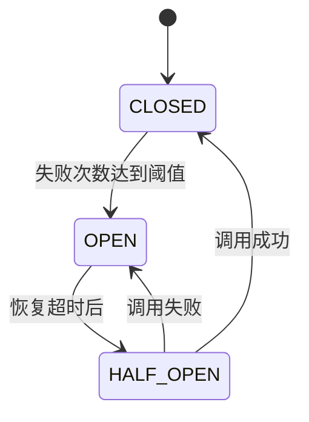

# 错误处理模块

## 概述

错误处理模块为NestJS学习API提供了全面的异常管理、服务降级和熔断机制。该模块通过统一的异常处理体系、智能重试策略和熔断器模式，确保应用程序在面对各种错误情况时能够优雅地处理并保持系统稳定性。

### 核心特性

- **全局异常过滤器** - 统一处理所有类型的异常
- **自定义异常类** - 针对不同业务场景的专用异常类型
- **熔断器模式** - 防止级联故障的服务保护机制
- **智能重试** - 带有指数退避和抖动的重试策略
- **健康检查** - 全面的服务健康监控
- **结构化错误响应** - 标准化的错误信息格式

### 技术栈

- **NestJS异常过滤器** - 全局异常处理
- **TypeORM错误处理** - 数据库异常管理
- **自定义异常类** - 业务逻辑异常
- **熔断器模式** - 服务保护机制
- **指数退避重试** - 智能重试策略

## 功能特性

### 1. 全局异常过滤器

全局异常过滤器是整个错误处理系统的核心，它拦截应用程序中的所有异常并提供统一的处理逻辑。

#### 实现原理

```typescript
@Catch()
export class GlobalExceptionFilter implements ExceptionFilter {
  constructor(
    private readonly loggingService: LoggingService,
    private readonly circuitBreakerService: CircuitBreakerService,
  ) {}

  catch(exception: unknown, host: ArgumentsHost): void {
    const ctx = host.switchToHttp()
    const response = ctx.getResponse<Response>()
    const request = ctx.getRequest<Request>()

    const errorInfo = this.processException(exception)
    
    const errorResponse = {
      statusCode: errorInfo.status,
      timestamp: new Date().toISOString(),
      path: request.url,
      method: request.method,
      message: errorInfo.message,
      error: errorInfo.error,
      code: errorInfo.code,
      ...(errorInfo.details && { details: errorInfo.details }),
      ...(errorInfo.context && { context: errorInfo.context }),
    }

    // 记录错误日志
    this.loggingService.logError(exception as Error, 'GlobalExceptionFilter', request)
    
    response.status(errorInfo.status).json(errorResponse)
  }
}
```

#### 异常分类处理

过滤器根据异常类型进行分类处理：

1. **业务异常** - BusinessException、ResourceNotFoundException等
2. **外部服务异常** - ExternalServiceException及其子类
3. **验证异常** - ValidationException、FileValidationException
4. **认证授权异常** - AuthenticationException、AuthorizationException
5. **数据库异常** - TypeORM相关异常
6. **HTTP异常** - 标准NestJS HttpException
7. **系统异常** - 系统级错误和未知异常

#### 错误响应格式

```json
{
  "statusCode": 400,
  "timestamp": "2023-12-01T10:00:00.000Z",
  "path": "/api/v1/users",
  "method": "POST",
  "message": "用户验证失败",
  "error": "Validation Error",
  "code": "VALIDATION_ERROR",
  "details": [
    {
      "field": "email",
      "value": "invalid-email",
      "constraints": ["必须是有效的邮箱地址"]
    }
  ],
  "context": {
    "resource": "User",
    "operation": "create"
  }
}
```

### 2. 自定义异常类体系

#### 业务异常类

**BusinessException** - 业务逻辑异常的基类：

```typescript
export class BusinessException extends HttpException {
  constructor(message: string, code?: string) {
    super(
      {
        message,
        error: 'Business Logic Error',
        code: code || 'BUSINESS_ERROR',
      },
      HttpStatus.BAD_REQUEST,
    )
  }
}

// 使用示例
throw new BusinessException('用户余额不足', 'INSUFFICIENT_BALANCE')
```

**ResourceNotFoundException** - 资源未找到异常：

```typescript
export class ResourceNotFoundException extends HttpException {
  constructor(resource: string, identifier?: string) {
    const message = identifier 
      ? `${resource} with identifier '${identifier}' not found`
      : `${resource} not found`
    
    super({
      message,
      error: 'Resource Not Found',
      code: 'RESOURCE_NOT_FOUND',
      resource,
      identifier,
    }, HttpStatus.NOT_FOUND)
  }
}

// 使用示例
throw new ResourceNotFoundException('User', userId)
```

**ResourceConflictException** - 资源冲突异常：

```typescript
export class ResourceConflictException extends HttpException {
  constructor(resource: string, field?: string, value?: string) {
    const message = field && value
      ? `${resource} with ${field} '${value}' already exists`
      : `${resource} already exists`
    
    super({
      message,
      error: 'Resource Conflict',
      code: 'RESOURCE_CONFLICT',
      resource,
      field,
      value,
    }, HttpStatus.CONFLICT)
  }
}

// 使用示例
throw new ResourceConflictException('User', 'email', 'user@example.com')
```

**InvalidOperationException** - 无效操作异常：

```typescript
export class InvalidOperationException extends HttpException {
  constructor(operation: string, reason?: string) {
    const message = reason
      ? `Cannot perform operation '${operation}': ${reason}`
      : `Invalid operation: ${operation}`
    
    super({
      message,
      error: 'Invalid Operation',
      code: 'INVALID_OPERATION',
      operation,
      reason,
    }, HttpStatus.BAD_REQUEST)
  }
}

// 使用示例
throw new InvalidOperationException('deleteUser', '用户仍有未完成的订单')
```

#### 外部服务异常类

**ExternalServiceException** - 外部服务异常基类：

```typescript
export class ExternalServiceException extends HttpException {
  constructor(
    service: string, 
    operation?: string, 
    originalError?: Error,
    isTemporary: boolean = true
  ) {
    const message = operation
      ? `${service} service is unavailable for operation: ${operation}`
      : `${service} service is unavailable`
    
    super({
      message,
      error: 'External Service Error',
      code: 'EXTERNAL_SERVICE_ERROR',
      service,
      operation,
      isTemporary,
      originalError: originalError?.message,
    }, isTemporary ? HttpStatus.SERVICE_UNAVAILABLE : HttpStatus.BAD_GATEWAY)
  }
}
```

**专用外部服务异常类**：

```typescript
// 数据库异常
export class DatabaseException extends ExternalServiceException {
  constructor(operation?: string, originalError?: Error) {
    super('Database', operation, originalError, true)
  }
}

// Redis异常
export class RedisException extends ExternalServiceException {
  constructor(operation?: string, originalError?: Error) {
    super('Redis', operation, originalError, true)
  }
}

// RabbitMQ异常
export class RabbitMQException extends ExternalServiceException {
  constructor(operation?: string, originalError?: Error) {
    super('RabbitMQ', operation, originalError, true)
  }
}

// gRPC服务异常
export class GrpcServiceException extends ExternalServiceException {
  constructor(service: string, operation?: string, originalError?: Error) {
    super(`gRPC-${service}`, operation, originalError, true)
  }
}
```

#### 验证异常类

**ValidationException** - 数据验证异常：

```typescript
export class ValidationException extends HttpException {
  constructor(errors: ValidationError[]) {
    super({
      message: 'Validation failed',
      error: 'Validation Error',
      code: 'VALIDATION_ERROR',
      details: errors,
    }, HttpStatus.BAD_REQUEST)
  }
}

export interface ValidationError {
  field: string
  value: any
  constraints: string[]
  children?: ValidationError[]
}

// 使用示例
const errors = [
  {
    field: 'email',
    value: 'invalid-email',
    constraints: ['必须是有效的邮箱地址']
  },
  {
    field: 'age',
    value: -1,
    constraints: ['必须是正数']
  }
]
throw new ValidationException(errors)
```

**FileValidationException** - 文件验证异常：

```typescript
export class FileValidationException extends HttpException {
  constructor(
    reason: string,
    allowedTypes?: string[],
    maxSize?: number,
    actualSize?: number
  ) {
    super({
      message: `File validation failed: ${reason}`,
      error: 'File Validation Error',
      code: 'FILE_VALIDATION_ERROR',
      reason,
      allowedTypes,
      maxSize,
      actualSize,
    }, HttpStatus.BAD_REQUEST)
  }
}

// 使用示例
throw new FileValidationException(
  '文件类型不支持',
  ['image/jpeg', 'image/png'],
  5 * 1024 * 1024, // 5MB
  10 * 1024 * 1024 // 10MB
)
```

#### 认证授权异常类

**AuthenticationException** - 认证异常：

```typescript
export class AuthenticationException extends HttpException {
  constructor(reason: string = 'Invalid credentials') {
    super({
      message: reason,
      error: 'Authentication Error',
      code: 'AUTHENTICATION_ERROR',
    }, HttpStatus.UNAUTHORIZED)
  }
}

// 使用示例
throw new AuthenticationException('令牌已过期')
```

**AuthorizationException** - 授权异常：

```typescript
export class AuthorizationException extends HttpException {
  constructor(
    resource: string,
    action: string,
    userRole?: string,
    requiredRole?: string
  ) {
    const message = `Access denied: insufficient permissions to ${action} ${resource}`
    
    super({
      message,
      error: 'Authorization Error',
      code: 'AUTHORIZATION_ERROR',
      resource,
      action,
      userRole,
      requiredRole,
    }, HttpStatus.FORBIDDEN)
  }
}

// 使用示例
throw new AuthorizationException('User', 'delete', 'user', 'admin')
```

### 3. 服务调用重试策略

#### 重试配置

```typescript
export interface RetryConfig {
  maxAttempts: number          // 最大重试次数
  baseDelay: number           // 基础延迟时间（毫秒）
  maxDelay: number            // 最大延迟时间（毫秒）
  backoffMultiplier: number   // 指数退避倍数
  jitter: boolean             // 是否添加随机抖动
  retryCondition?: (error: Error) => boolean // 自定义重试条件
}

export const DEFAULT_RETRY_CONFIG: RetryConfig = {
  maxAttempts: 3,
  baseDelay: 1000,
  maxDelay: 30000,
  backoffMultiplier: 2,
  jitter: true,
  retryCondition: (error: Error) => {
    // 对网络错误、超时和临时服务错误进行重试
    return error.message.includes('ECONNREFUSED') ||
           error.message.includes('ETIMEDOUT') ||
           error.message.includes('ENOTFOUND') ||
           error.message.includes('Service Unavailable') ||
           error.message.includes('Internal Server Error')
  }
}
```

#### 重试实现

```typescript
export class RetryUtil {
  static async executeWithRetry<T>(
    fn: () => Promise<T>,
    config: Partial<RetryConfig> = {}
  ): Promise<T> {
    const finalConfig = { ...DEFAULT_RETRY_CONFIG, ...config }
    let lastError: Error
    
    for (let attempt = 1; attempt <= finalConfig.maxAttempts; attempt++) {
      try {
        return await fn()
      } catch (error) {
        lastError = error as Error
        
        // 最后一次尝试不再重试
        if (attempt === finalConfig.maxAttempts) {
          break
        }
        
        // 检查是否应该重试此错误
        if (finalConfig.retryCondition && !finalConfig.retryCondition(lastError)) {
          break
        }
        
        // 计算延迟时间（指数退避）
        const delay = this.calculateDelay(attempt, finalConfig)
        
        // 等待后重试
        await this.sleep(delay)
      }
    }
    
    throw lastError
  }

  private static calculateDelay(attempt: number, config: RetryConfig): number {
    // 指数退避：baseDelay * (backoffMultiplier ^ (attempt - 1))
    let delay = config.baseDelay * Math.pow(config.backoffMultiplier, attempt - 1)
    
    // 限制最大延迟
    delay = Math.min(delay, config.maxDelay)
    
    // 添加抖动防止惊群效应
    if (config.jitter) {
      const jitterRange = delay * 0.25
      const jitter = (Math.random() - 0.5) * 2 * jitterRange
      delay += jitter
    }
    
    return Math.max(0, Math.floor(delay))
  }
}
```

#### 重试使用示例

```typescript
// 基础重试
const result = await RetryUtil.executeWithRetry(
  () => unreliableOperation(),
  { maxAttempts: 3, baseDelay: 1000 }
)

// 创建重试包装器
const retryableFunction = RetryUtil.createRetryWrapper(
  unreliableOperation,
  { maxAttempts: 5, baseDelay: 500 }
)

// 自定义重试条件
const result = await RetryUtil.executeWithRetry(
  () => databaseOperation(),
  {
    maxAttempts: 5,
    baseDelay: 2000,
    retryCondition: (error) => {
      // 只对特定数据库错误重试
      return error.message.includes('connection timeout') ||
             error.message.includes('deadlock')
    }
  }
)
```

## 配置说明

### 环境变量配置

```env
# 熔断器设置
CIRCUIT_BREAKER_FAILURE_THRESHOLD=5
CIRCUIT_BREAKER_RECOVERY_TIMEOUT=30000
CIRCUIT_BREAKER_MONITORING_PERIOD=60000

# 重试设置
RETRY_MAX_ATTEMPTS=3
RETRY_BASE_DELAY=1000
RETRY_MAX_DELAY=30000

# 错误日志级别
ERROR_LOG_LEVEL=error
ERROR_LOG_INCLUDE_STACK=true
```

### 模块集成

```typescript
import { ErrorHandlingModule } from './common/error-handling/error-handling.module'

@Module({
  imports: [
    ErrorHandlingModule, // 全局错误处理
    // ... 其他模块
  ],
})
export class AppModule {}
```

### 全局异常过滤器注册

```typescript
// main.ts
import { GlobalExceptionFilter } from './common/filters/global-exception.filter'

async function bootstrap() {
  const app = await NestJS.create(AppModule)
  
  // 注册全局异常过滤器
  app.useGlobalFilters(new GlobalExceptionFilter())
  
  await app.listen(3000)
}
```

## API接口

### 健康检查和监控端点

- `GET /health` - 基础健康检查
- `GET /health/detailed` - 详细健康状态（包含熔断器状态）
- `GET /health/circuit-breakers` - 熔断器状态查询
- `POST /health/circuit-breakers/:serviceName/reset` - 重置指定熔断器

### 演示端点（仅开发环境）

- `GET /demo/error-handling/business-error` - 触发业务异常
- `GET /demo/error-handling/resource-not-found/:id` - 触发资源未找到异常
- `GET /demo/error-handling/circuit-breaker-demo` - 演示熔断器功能
- `GET /demo/error-handling/retry-demo` - 演示重试机制
- `POST /demo/error-handling/validation-error` - 触发验证异常

## 使用示例

### 基础异常处理

```typescript
@Controller('users')
export class UsersController {
  constructor(private readonly usersService: UsersService) {}

  @Get(':id')
  async findOne(@Param('id') id: string) {
    try {
      return await this.usersService.findOne(id)
    } catch (error) {
      if (error.code === 'USER_NOT_FOUND') {
        throw new ResourceNotFoundException('User', id)
      }
      throw error
    }
  }

  @Post()
  async create(@Body() createUserDto: CreateUserDto) {
    try {
      return await this.usersService.create(createUserDto)
    } catch (error) {
      if (error.code === '23505') { // PostgreSQL unique violation
        throw new ResourceConflictException('User', 'email', createUserDto.email)
      }
      throw new DatabaseException('create user', error)
    }
  }
}
```

### 服务层异常处理

```typescript
@Injectable()
export class UsersService {
  constructor(
    @InjectRepository(User) private usersRepository: Repository<User>,
    private readonly cacheService: CacheService,
  ) {}

  async findOne(id: string): Promise<User> {
    try {
      // 尝试从缓存获取
      const cached = await this.cacheService.get(`user:${id}`)
      if (cached) {
        return cached
      }
    } catch (error) {
      // 缓存失败不影响主要功能
      throw new RedisException('get user from cache', error)
    }

    const user = await this.usersRepository.findOne({ where: { id } })
    if (!user) {
      throw new ResourceNotFoundException('User', id)
    }

    try {
      // 缓存用户数据
      await this.cacheService.set(`user:${id}`, user, 3600)
    } catch (error) {
      // 缓存失败记录日志但不抛出异常
      console.warn('Failed to cache user data:', error.message)
    }

    return user
  }

  async validateUserPermission(userId: string, resource: string, action: string) {
    const user = await this.findOne(userId)
    
    if (!user.isActive) {
      throw new AuthenticationException('用户账户已被禁用')
    }

    const hasPermission = await this.checkPermission(user, resource, action)
    if (!hasPermission) {
      throw new AuthorizationException(resource, action, user.role, 'admin')
    }
  }
}
```

### 带重试的外部服务调用

```typescript
@Injectable()
export class PaymentService {
  constructor(private readonly httpService: HttpService) {}

  async processPayment(paymentData: PaymentDto): Promise<PaymentResult> {
    return RetryUtil.executeWithRetry(
      async () => {
        try {
          const response = await this.httpService.post('/api/payments', paymentData).toPromise()
          return response.data
        } catch (error) {
          if (error.response?.status >= 500) {
            // 服务器错误，可以重试
            throw new ExternalServiceException('Payment Gateway', 'process payment', error, true)
          } else {
            // 客户端错误，不应重试
            throw new BusinessException('支付信息无效', 'INVALID_PAYMENT_DATA')
          }
        }
      },
      {
        maxAttempts: 3,
        baseDelay: 2000,
        maxDelay: 10000,
        retryCondition: (error) => {
          return error instanceof ExternalServiceException && 
                 (error.getResponse() as any).isTemporary
        }
      }
    )
  }
}
```

## 熔断机制和降级处理

### 1. 熔断器模式实现

熔断器模式是一种防止级联故障的重要机制，通过监控服务调用的成功率来决定是否暂时阻断对失败服务的调用。

#### 熔断器状态



**CLOSED（关闭状态）**：
- 正常运行状态，所有请求都会通过
- 监控失败次数和成功率
- 当失败次数达到阈值时转换为OPEN状态

**OPEN（开启状态）**：
- 熔断器开启，所有请求立即失败
- 不会调用实际的服务
- 等待恢复超时时间后转换为HALF_OPEN状态

**HALF_OPEN（半开状态）**：
- 测试服务是否已恢复
- 允许少量请求通过进行测试
- 根据测试结果决定转换为CLOSED或OPEN状态

#### 熔断器配置

```typescript
export interface CircuitBreakerConfig {
  failureThreshold: number    // 失败阈值（触发熔断的失败次数）
  recoveryTimeout: number     // 恢复超时时间（毫秒）
  monitoringPeriod: number   // 监控周期（毫秒）
  expectedErrorRate: number  // 预期错误率（0-1）
}

// 默认配置
const defaultConfig: CircuitBreakerConfig = {
  failureThreshold: 5,        // 5次失败后熔断
  recoveryTimeout: 30000,     // 30秒后尝试恢复
  monitoringPeriod: 60000,    // 1分钟监控周期
  expectedErrorRate: 0.1      // 10%预期错误率
}
```

#### 熔断器核心实现

```typescript
export class CircuitBreaker {
  private state: CircuitBreakerState = CircuitBreakerState.CLOSED
  private failureCount: number = 0
  private lastFailureTime: number = 0
  private nextAttemptTime: number = 0
  private successCount: number = 0

  async execute<T>(fn: () => Promise<T>): Promise<T> {
    // 检查熔断器状态
    if (this.state === CircuitBreakerState.OPEN) {
      if (Date.now() < this.nextAttemptTime) {
        throw new Error(`Circuit breaker is OPEN for ${this.serviceName}`)
      }
      // 转换为半开状态进行测试
      this.state = CircuitBreakerState.HALF_OPEN
    }

    try {
      const result = await fn()
      this.onSuccess()  // 处理成功
      return result
    } catch (error) {
      this.onFailure()  // 处理失败
      throw error
    }
  }

  private onSuccess(): void {
    this.failureCount = 0
    this.successCount++
    
    if (this.state === CircuitBreakerState.HALF_OPEN) {
      this.state = CircuitBreakerState.CLOSED
    }
  }

  private onFailure(): void {
    this.failureCount++
    this.lastFailureTime = Date.now()

    if (this.failureCount >= this.config.failureThreshold) {
      this.state = CircuitBreakerState.OPEN
      this.nextAttemptTime = Date.now() + this.config.recoveryTimeout
    }
  }
}
```

### 2. 熔断器装饰器使用

#### 通用熔断器装饰器

```typescript
@UseCircuitBreaker('custom-service', {
  failureThreshold: 3,
  recoveryTimeout: 15000,
  monitoringPeriod: 30000,
  expectedErrorRate: 0.15
})
async customServiceCall() {
  // 自定义服务调用逻辑
  return await this.externalService.call()
}
```

#### 预定义服务装饰器

**数据库熔断器**：

```typescript
@DatabaseCircuitBreaker()
async databaseOperation() {
  return await this.userRepository.find()
}

// 自定义数据库熔断器配置
@DatabaseCircuitBreaker({
  failureThreshold: 3,
  recoveryTimeout: 20000
})
async criticalDatabaseOperation() {
  return await this.orderRepository.save(order)
}
```

**Redis熔断器**：

```typescript
@RedisCircuitBreaker()
async cacheOperation() {
  return await this.cacheService.get('key')
}

// 自定义Redis熔断器配置
@RedisCircuitBreaker({
  failureThreshold: 2,
  recoveryTimeout: 10000
})
async criticalCacheOperation() {
  return await this.cacheService.set('key', value)
}
```

**RabbitMQ熔断器**：

```typescript
@RabbitMQCircuitBreaker()
async sendMessage() {
  return await this.messageService.send(message)
}
```

**gRPC熔断器**：

```typescript
@GrpcCircuitBreaker('user-service')
async grpcUserCall() {
  return await this.grpcUserService.getUser(userId)
}

@GrpcCircuitBreaker('notification-service', {
  failureThreshold: 2,
  recoveryTimeout: 5000
})
async grpcNotificationCall() {
  return await this.grpcNotificationService.send(notification)
}
```

### 3. 熔断器服务管理

#### CircuitBreakerService使用

```typescript
@Injectable()
export class PaymentService {
  constructor(
    private readonly circuitBreakerService: CircuitBreakerService,
    private readonly httpService: HttpService
  ) {}

  async processPayment(paymentData: PaymentDto): Promise<PaymentResult> {
    return this.circuitBreakerService.executeWithCircuitBreaker(
      'payment-gateway',
      async () => {
        const response = await this.httpService.post('/api/payments', paymentData).toPromise()
        return response.data
      },
      {
        failureThreshold: 3,
        recoveryTimeout: 20000,
        monitoringPeriod: 60000,
        expectedErrorRate: 0.05
      }
    )
  }

  async getPaymentStatus(paymentId: string): Promise<PaymentStatus> {
    try {
      return await this.circuitBreakerService.executeWithCircuitBreaker(
        'payment-gateway',
        async () => {
          const response = await this.httpService.get(`/api/payments/${paymentId}`).toPromise()
          return response.data
        }
      )
    } catch (error) {
      // 熔断器开启时的降级处理
      if (error.message.includes('Circuit breaker is OPEN')) {
        return {
          id: paymentId,
          status: 'UNKNOWN',
          message: '支付状态查询服务暂时不可用，请稍后重试'
        }
      }
      throw error
    }
  }
}
```

#### 熔断器状态监控

```typescript
@Controller('health')
export class HealthController {
  constructor(
    private readonly circuitBreakerService: CircuitBreakerService
  ) {}

  @Get('circuit-breakers')
  getCircuitBreakerStatus() {
    return {
      timestamp: new Date().toISOString(),
      circuitBreakers: this.circuitBreakerService.getAllStatus()
    }
  }

  @Post('circuit-breakers/:serviceName/reset')
  resetCircuitBreaker(@Param('serviceName') serviceName: string) {
    const success = this.circuitBreakerService.resetCircuitBreaker(serviceName)
    return {
      success,
      message: success 
        ? `熔断器 ${serviceName} 已重置`
        : `熔断器 ${serviceName} 未找到`,
      timestamp: new Date().toISOString()
    }
  }

  @Post('circuit-breakers/reset-all')
  resetAllCircuitBreakers() {
    this.circuitBreakerService.resetAllCircuitBreakers()
    return {
      success: true,
      message: '所有熔断器已重置',
      timestamp: new Date().toISOString()
    }
  }
}
```

### 4. 服务降级实现方法

#### 降级策略模式

```typescript
interface FallbackStrategy<T> {
  execute(): Promise<T>
  canHandle(error: Error): boolean
}

class CacheFallbackStrategy implements FallbackStrategy<any> {
  constructor(
    private readonly cacheService: CacheService,
    private readonly fallbackKey: string
  ) {}

  async execute(): Promise<any> {
    // 从备用缓存获取数据
    return await this.cacheService.get(`fallback:${this.fallbackKey}`)
  }

  canHandle(error: Error): boolean {
    return error.message.includes('Circuit breaker is OPEN') ||
           error.message.includes('Service Unavailable')
  }
}

class DefaultValueFallbackStrategy<T> implements FallbackStrategy<T> {
  constructor(private readonly defaultValue: T) {}

  async execute(): Promise<T> {
    return this.defaultValue
  }

  canHandle(error: Error): boolean {
    return true // 可以处理任何错误
  }
}
```

#### 服务降级装饰器

```typescript
export function WithFallback<T>(
  fallbackStrategies: FallbackStrategy<T>[]
) {
  return function (target: any, propertyName: string, descriptor: PropertyDescriptor) {
    const method = descriptor.value

    descriptor.value = async function (...args: any[]) {
      try {
        return await method.apply(this, args)
      } catch (error) {
        // 尝试降级策略
        for (const strategy of fallbackStrategies) {
          if (strategy.canHandle(error)) {
            console.warn(`使用降级策略处理错误: ${error.message}`)
            return await strategy.execute()
          }
        }
        throw error
      }
    }
  }
}

// 使用示例
@Injectable()
export class UserService {
  @WithFallback([
    new CacheFallbackStrategy(cacheService, 'user-list'),
    new DefaultValueFallbackStrategy([])
  ])
  @DatabaseCircuitBreaker()
  async getUsers(): Promise<User[]> {
    return await this.userRepository.find()
  }
}
```

#### 多级降级处理

```typescript
@Injectable()
export class RecommendationService {
  constructor(
    private readonly aiService: AIService,
    private readonly cacheService: CacheService,
    private readonly configService: ConfigService
  ) {}

  async getRecommendations(userId: string): Promise<Recommendation[]> {
    try {
      // 第一级：AI推荐服务
      return await this.circuitBreakerService.executeWithCircuitBreaker(
        'ai-recommendation',
        () => this.aiService.getPersonalizedRecommendations(userId)
      )
    } catch (error) {
      console.warn('AI推荐服务不可用，尝试缓存降级')
      
      try {
        // 第二级：缓存降级
        const cached = await this.cacheService.get(`recommendations:${userId}`)
        if (cached) {
          return cached
        }
      } catch (cacheError) {
        console.warn('缓存服务不可用，尝试规则降级')
      }
      
      try {
        // 第三级：基于规则的推荐
        return await this.getRuleBasedRecommendations(userId)
      } catch (ruleError) {
        console.warn('规则推荐失败，返回默认推荐')
        
        // 第四级：默认推荐
        return await this.getDefaultRecommendations()
      }
    }
  }

  private async getRuleBasedRecommendations(userId: string): Promise<Recommendation[]> {
    // 基于用户历史和简单规则的推荐逻辑
    const userHistory = await this.getUserHistory(userId)
    return this.generateRuleBasedRecommendations(userHistory)
  }

  private async getDefaultRecommendations(): Promise<Recommendation[]> {
    // 返回热门或默认推荐
    return this.configService.get('defaultRecommendations', [])
  }
}
```

### 5. 错误处理最佳实践

#### 1. 熔断器配置最佳实践

```typescript
// 根据服务特性配置不同的熔断器参数
const circuitBreakerConfigs = {
  // 关键服务：更严格的熔断策略
  database: {
    failureThreshold: 3,
    recoveryTimeout: 30000,
    monitoringPeriod: 60000,
    expectedErrorRate: 0.05
  },
  
  // 缓存服务：相对宽松的策略
  cache: {
    failureThreshold: 5,
    recoveryTimeout: 15000,
    monitoringPeriod: 30000,
    expectedErrorRate: 0.15
  },
  
  // 外部API：考虑网络延迟的策略
  externalApi: {
    failureThreshold: 4,
    recoveryTimeout: 45000,
    monitoringPeriod: 120000,
    expectedErrorRate: 0.1
  }
}
```

#### 2. 异常分类和处理策略

```typescript
class ErrorClassifier {
  static classifyError(error: Error): ErrorType {
    if (error.message.includes('ECONNREFUSED') || 
        error.message.includes('ETIMEDOUT')) {
      return ErrorType.NETWORK_ERROR
    }
    
    if (error.message.includes('Circuit breaker is OPEN')) {
      return ErrorType.CIRCUIT_BREAKER_ERROR
    }
    
    if (error.message.includes('Validation failed')) {
      return ErrorType.VALIDATION_ERROR
    }
    
    return ErrorType.UNKNOWN_ERROR
  }

  static shouldRetry(error: Error): boolean {
    const errorType = this.classifyError(error)
    return errorType === ErrorType.NETWORK_ERROR || 
           errorType === ErrorType.CIRCUIT_BREAKER_ERROR
  }

  static shouldUseCircuitBreaker(error: Error): boolean {
    const errorType = this.classifyError(error)
    return errorType === ErrorType.NETWORK_ERROR
  }
}
```

#### 3. 监控和告警集成

```typescript
@Injectable()
export class ErrorMonitoringService {
  constructor(
    private readonly metricsService: MetricsService,
    private readonly alertService: AlertService
  ) {}

  recordCircuitBreakerEvent(serviceName: string, event: string, state: string) {
    // 记录熔断器事件指标
    this.metricsService.increment('circuit_breaker_events', {
      service: serviceName,
      event,
      state
    })

    // 熔断器开启时发送告警
    if (event === 'opened') {
      this.alertService.sendAlert({
        level: 'warning',
        message: `熔断器已开启: ${serviceName}`,
        service: serviceName,
        timestamp: new Date()
      })
    }
  }

  recordErrorRate(serviceName: string, errorRate: number) {
    this.metricsService.gauge('service_error_rate', errorRate, {
      service: serviceName
    })

    // 错误率过高时发送告警
    if (errorRate > 0.2) {
      this.alertService.sendAlert({
        level: 'critical',
        message: `服务错误率过高: ${serviceName} (${errorRate * 100}%)`,
        service: serviceName,
        errorRate,
        timestamp: new Date()
      })
    }
  }
}
```

#### 4. 测试策略

```typescript
describe('CircuitBreaker', () => {
  let circuitBreaker: CircuitBreaker
  let mockService: jest.Mock

  beforeEach(() => {
    mockService = jest.fn()
    circuitBreaker = new CircuitBreaker('test-service', {
      failureThreshold: 3,
      recoveryTimeout: 1000,
      monitoringPeriod: 5000,
      expectedErrorRate: 0.1
    })
  })

  it('should open circuit after failure threshold', async () => {
    // 模拟连续失败
    mockService.mockRejectedValue(new Error('Service failure'))
    
    for (let i = 0; i < 3; i++) {
      try {
        await circuitBreaker.execute(mockService)
      } catch (error) {
        // 预期的失败
      }
    }

    expect(circuitBreaker.getStatus().state).toBe(CircuitBreakerState.OPEN)
  })

  it('should transition to half-open after recovery timeout', async () => {
    // 先触发熔断
    mockService.mockRejectedValue(new Error('Service failure'))
    for (let i = 0; i < 3; i++) {
      try {
        await circuitBreaker.execute(mockService)
      } catch (error) {}
    }

    // 等待恢复超时
    await new Promise(resolve => setTimeout(resolve, 1100))

    // 下次调用应该转为半开状态
    mockService.mockResolvedValue('success')
    await circuitBreaker.execute(mockService)

    expect(circuitBreaker.getStatus().state).toBe(CircuitBreakerState.CLOSED)
  })
})
```

#### 5. 性能优化建议

```typescript
// 1. 使用连接池减少连接开销
@Injectable()
export class DatabaseService {
  constructor(
    @InjectDataSource() private dataSource: DataSource
  ) {
    // 配置连接池
    this.dataSource.setOptions({
      ...this.dataSource.options,
      extra: {
        max: 20,          // 最大连接数
        min: 5,           // 最小连接数
        acquireTimeoutMillis: 30000,
        createTimeoutMillis: 30000,
        destroyTimeoutMillis: 5000,
        idleTimeoutMillis: 30000,
        reapIntervalMillis: 1000,
        createRetryIntervalMillis: 200
      }
    })
  }
}

// 2. 实现请求去重避免重复调用
class RequestDeduplicator {
  private pendingRequests = new Map<string, Promise<any>>()

  async execute<T>(key: string, fn: () => Promise<T>): Promise<T> {
    if (this.pendingRequests.has(key)) {
      return this.pendingRequests.get(key)
    }

    const promise = fn().finally(() => {
      this.pendingRequests.delete(key)
    })

    this.pendingRequests.set(key, promise)
    return promise
  }
}

// 3. 使用批量操作减少网络调用
@Injectable()
export class BatchProcessor {
  private batch: any[] = []
  private batchTimeout: NodeJS.Timeout | null = null

  addToBatch(item: any): Promise<any> {
    return new Promise((resolve, reject) => {
      this.batch.push({ item, resolve, reject })
      
      if (this.batch.length >= 10) {
        this.processBatch()
      } else if (!this.batchTimeout) {
        this.batchTimeout = setTimeout(() => this.processBatch(), 100)
      }
    })
  }

  private async processBatch() {
    if (this.batchTimeout) {
      clearTimeout(this.batchTimeout)
      this.batchTimeout = null
    }

    const currentBatch = this.batch.splice(0)
    if (currentBatch.length === 0) return

    try {
      const results = await this.batchOperation(currentBatch.map(b => b.item))
      currentBatch.forEach((b, index) => b.resolve(results[index]))
    } catch (error) {
      currentBatch.forEach(b => b.reject(error))
    }
  }

  private async batchOperation(items: any[]): Promise<any[]> {
    // 实现批量操作逻辑
    return items.map(item => ({ processed: true, item }))
  }
}
```

## 故障排除

### 常见问题解答

**Q: 熔断器频繁开启怎么办？**

A: 检查以下几个方面：
1. 失败阈值是否设置过低
2. 服务是否真的存在问题
3. 网络延迟是否过高
4. 是否需要调整恢复超时时间

**Q: 如何调试熔断器状态？**

A: 使用健康检查端点：
```bash
# 查看所有熔断器状态
curl http://localhost:3000/health/circuit-breakers

# 重置特定熔断器
curl -X POST http://localhost:3000/health/circuit-breakers/database/reset
```

**Q: 重试机制与熔断器冲突怎么办？**

A: 合理配置重试和熔断器参数：
```typescript
// 重试配置应该考虑熔断器的恢复时间
const retryConfig = {
  maxAttempts: 3,
  baseDelay: 1000,
  maxDelay: 5000  // 小于熔断器恢复时间
}

const circuitBreakerConfig = {
  failureThreshold: 5,
  recoveryTimeout: 30000  // 大于重试最大延迟
}
```

### 调试技巧

1. **启用详细日志**：
```typescript
// 在开发环境启用详细的错误日志
if (process.env.NODE_ENV === 'development') {
  app.useGlobalFilters(new GlobalExceptionFilter(true)) // 启用详细模式
}
```

2. **使用健康检查监控**：
```typescript
// 定期检查服务健康状态
setInterval(async () => {
  const health = await healthService.getHealthStatus()
  console.log('Health Status:', health)
}, 30000)
```

3. **错误统计分析**：
```typescript
// 收集错误统计信息
const errorStats = {
  businessErrors: 0,
  networkErrors: 0,
  validationErrors: 0,
  systemErrors: 0
}

// 在异常过滤器中统计
private updateErrorStats(errorType: string) {
  errorStats[errorType]++
  
  // 每小时输出统计信息
  if (Date.now() % 3600000 < 1000) {
    console.log('Hourly Error Stats:', errorStats)
  }
}
```

## 相关资源

- [NestJS异常过滤器官方文档](https://docs.nestjs.com/exception-filters)
- [熔断器模式详解](https://martinfowler.com/bliki/CircuitBreaker.html)
- [微服务容错模式](https://docs.microsoft.com/en-us/azure/architecture/patterns/circuit-breaker)
- [TypeORM错误处理](https://typeorm.io/error-handling)
- [RxJS错误处理](https://rxjs.dev/guide/error-handling)